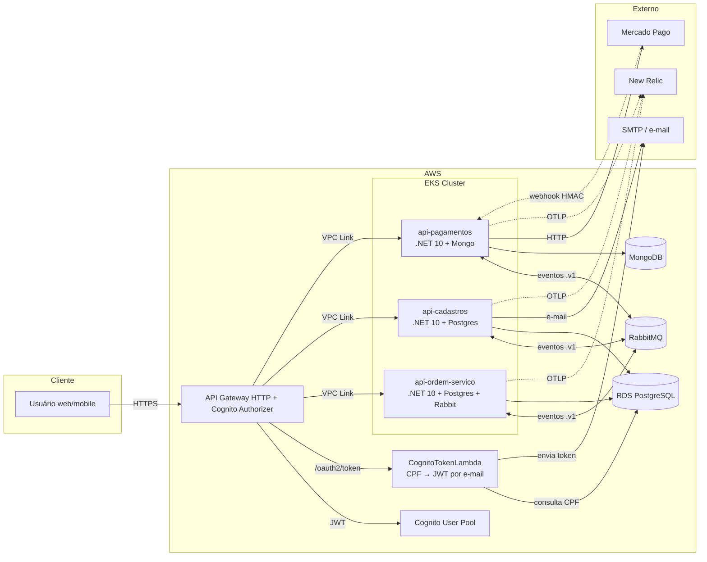

# Planejamento da Wiki — Mecânica Hermes

> Documento mestre que orienta a construção e a manutenção da Wiki consolidada
> do ecossistema **Mecânica Hermes** (Tech Challenge 13SOAT — FIAP).
>
> Esta Wiki vive no GitHub do repositório [`mecanica-hermes-docs`](https://github.com/fiap-challenge-13soat/mecanica-hermes-docs/wiki)
> e centraliza, em um único ponto de leitura, o conhecimento hoje espalhado
> pelos READMEs, `CLAUDE.md`, `docs/` e ADRs dos **9 repositórios** que compõem
> o ecossistema.
>
> **Status:** plano aprovado, conteúdo em construção.
> **Última atualização:** 2026-05-18.

---

## Sumário

1. [Sumário executivo](#1-sumário-executivo)
2. [Objetivos da Wiki](#2-objetivos-da-wiki)
3. [Audiências e jornadas](#3-audiências-e-jornadas)
4. [Mapa do ecossistema (9 repositórios)](#4-mapa-do-ecossistema-9-repositórios)
5. [Princípios editoriais](#5-princípios-editoriais)
6. [Arquitetura da informação (sidebar)](#6-arquitetura-da-informação-sidebar)
7. [Detalhamento das páginas](#7-detalhamento-das-páginas)
8. [Mapeamento de fontes de conteúdo](#8-mapeamento-de-fontes-de-conteúdo)
9. [Convenções (diagramas, nomenclatura, links)](#9-convenções)
10. [Roadmap de construção em fases](#10-roadmap-de-construção-em-fases)
11. [Governança e ciclo de vida](#11-governança-e-ciclo-de-vida)
12. [Templates de páginas](#12-templates-de-páginas)
13. [Apêndice — checklist de pronto-para-publicar](#13-apêndice--checklist-de-pronto-para-publicar)

---

## 1. Sumário executivo

A Mecânica Hermes é o backend de uma oficina mecânica composto por **três
microsserviços .NET 10** (Ordem de Serviço, Cadastros, Pagamentos), um **SDK
compartilhado** em GitHub Packages, uma **AWS Lambda** de autenticação por CPF,
**infraestrutura como código** em Terraform sobre AWS (EKS, RDS, Cognito, API
Gateway), **deploy declarativo via Kustomize** e uma **suíte E2E** em Robot
Framework BDD. Hoje cada repositório carrega sua própria documentação rica
(READMEs longos, `docs/` por tema, ADRs, RFCs), mas falta um **ponto único de
entrada** que apresente o produto, conecte os repositórios e ofereça caminhos
de leitura por persona.

A Wiki cumpre esse papel. Ela **não substitui** as docs locais dos repositórios
— ela **referencia** e **costura** para que um avaliador, um novo contribuidor
ou um operador encontre rapidamente o que precisa **sem precisar adivinhar em
qual repositório procurar**.

O modelo editorial é inspirado em **arc42** (estrutura de documentação de
arquitetura), **C4 Model** (níveis de zoom em diagramas) e **Diátaxis**
(separação clara entre tutorial, how-to, referência e explicação). A
nomenclatura segue o padrão dos READMEs existentes (português), e os
diagramas seguem o padrão **Mermaid** já adotado nos repositórios.

---

## 2. Objetivos da Wiki

| # | Objetivo | Como medimos |
|---|---|---|
| O1 | Ser o **primeiro lugar** que qualquer pessoa procura para entender o produto | Home tem link claro para cada audiência (avaliador, dev novo, operador, integrador) |
| O2 | Explicar o **negócio** (oficina mecânica → OS → orçamento → pagamento → entrega) em uma página acessível para não-engenheiros | Página "Domínio de Negócio" lê-se em 5 min sem jargão |
| O3 | Apresentar a **arquitetura cross-service** que hoje só existe distribuída nos `CLAUDE.md` dos três repos .NET | Diagrama C4 nível 1 e 2 + página "Como os serviços conversam" |
| O4 | Servir como **índice navegável** dos 9 repositórios, evitando que o leitor precise abrir cada um para entender o papel | Página "Repositórios" com tabela, status, badges e links profundos |
| O5 | Documentar os **fluxos de ponta-a-ponta** (caminho feliz + cenários alternativos) que hoje só existem como suítes Robot | 8 fluxos descritos textualmente com diagramas de sequência |
| O6 | Centralizar o **catálogo de eventos** `.v1` que circulam no RabbitMQ | Tabela única com os 7 eventos versionados, publishers e consumers |
| O7 | Servir de **runbook macro** para incidentes que atravessam serviços | Página "Diagnóstico cross-service" com fluxograma de triagem |
| O8 | Preservar **decisões arquiteturais** (ADRs/RFCs) consolidadas e pesquisáveis | Página "Decisões" agregando ADRs dos 9 repos em ordem cronológica |
| O9 | Apresentar o **Tech Challenge** como contexto acadêmico, vinculando entregáveis aos requisitos do enunciado | Página "Tech Challenge — FIAP 13SOAT" com mapeamento entregável → fase |
| O10 | Ser **autossustentável** — atualizada por todo o time com baixa cerimônia | Convenção de Sidebar fixa + template de página padrão |

### O que a Wiki **não** é

- **Não é** referência de API substituindo Scalar/OpenAPI. Para isso, linkamos para os endpoints `/scalar` de cada serviço.
- **Não é** o `docs/` de um único repositório. A profundidade técnica fica nos repos; a Wiki resume e conecta.
- **Não é** changelog ou release notes. Para isso, GitHub Releases.
- **Não é** dashboard de status de CI. Para isso, badges nos READMEs e SonarCloud.

---

## 3. Audiências e jornadas

A Wiki é organizada para servir **5 personas**. Cada uma tem uma "porta de entrada" na Home.

### 3.1 Avaliador / Banca FIAP

**Necessidade:** confirmar em ≤ 15 min que o entregável cumpre o enunciado do Tech Challenge.

**Jornada:** Home → Tech Challenge → Domínio de Negócio → Arquitetura (visão C4 nível 1) → Demonstração (vídeo, link público de hml) → Decisões (ADRs).

### 3.2 Desenvolvedor novo no time

**Necessidade:** rodar o ecossistema localmente, entender em qual repo trabalhar, conhecer convenções.

**Jornada:** Home → Início Rápido (stack via Docker Compose E2E) → Visão geral dos serviços → Convenções (Clean Architecture, Result Pattern, eventos `.v1`) → Como contribuir → Repositórios → Repo específico.

### 3.3 Operador / SRE

**Necessidade:** saber o que monitorar, onde estão métricas, e como diagnosticar incidentes.

**Jornada:** Home → Observabilidade → Runbook macro → Métricas e dashboards New Relic → Runbook específico do serviço com problema.

### 3.4 Integrador externo (consumindo a API)

**Necessidade:** obter token, conhecer endpoints, entender semântica assíncrona (`202 Accepted`).

**Jornada:** Home → API pública → Autenticação (Cognito + Lambda CPF) → Endpoints (links para Scalar) → Webhooks (HMAC, idempotência).

### 3.5 Arquiteto / Lead técnico

**Necessidade:** entender decisões arquiteturais, evolução de contratos, dívida técnica.

**Jornada:** Home → Decisões (ADRs/RFCs) → Catálogo de eventos → SDK compartilhado (versionamento) → Padrões transversais (SAGA, Outbox, State Pattern).

---

## 4. Mapa do ecossistema (9 repositórios)

| # | Repositório | Categoria | Tecnologia | Papel resumido |
|---|---|---|---|---|
| 1 | [`mecanica-hermes-infra`](https://github.com/fiap-challenge-13soat/mecanica-hermes-infra) | Infraestrutura | Terraform, AWS | Provisiona VPC, EKS, RDS, Cognito, API Gateway. 5 módulos: `aws/`, `learner-lab/`, `cognito/`, `db/`, `api-gateway/` |
| 2 | [`mecanica-hermes-k8s`](https://github.com/fiap-challenge-13soat/mecanica-hermes-k8s) | Infraestrutura | Kustomize, Helm | Deploy das APIs no EKS com overlays `hml`/`prd`. Instala New Relic via Helm |
| 3 | [`mecanica-hermes-lambda`](https://github.com/fiap-challenge-13soat/mecanica-hermes-lambda) | Infraestrutura | .NET 10, AWS Lambda | `CognitoTokenLambda` — autentica cliente por CPF, gera JWT via Cognito Client Credentials e envia por e-mail |
| 4 | [`mecanica-hermes-api-ordem-servico`](https://github.com/fiap-challenge-13soat/mecanica-hermes-api-ordem-servico) | Domínio | .NET 10, PostgreSQL, RabbitMQ, MongoDB | **Orquestrador principal**. Agregado `OrdemDeServico` com state machine de 8 estados, SAGA MassTransit, Outbox transacional |
| 5 | [`mecanica-hermes-api-cadastros`](https://github.com/fiap-challenge-13soat/mecanica-hermes-api-cadastros) | Domínio | .NET 10, PostgreSQL | Cadastros de `Cliente` (+ veículos) e `Produto`. Webhook HMAC de aprovação/rejeição de orçamento. Soft delete. Expõe `GET /api/clientes/{id}` M2M |
| 6 | [`mecanica-hermes-api-pagamentos`](https://github.com/fiap-challenge-13soat/mecanica-hermes-api-pagamentos) | Domínio | .NET 10, MongoDB | Integração Mercado Pago. SAGA própria com confirmação dupla (webhook HMAC + polling). M2M para Cadastros |
| 7 | [`mecanica-hermes-api-sdk`](https://github.com/fiap-challenge-13soat/mecanica-hermes-api-sdk) | Plataforma | .NET 10, GitHub Packages | 6 pacotes NuGet: `Core`, `Application`, `AspNetCore`, `Observability`, `MassTransit`, `Contracts` (7 eventos `.v1`) |
| 8 | [`mecanica-hermes-tests-e2e`](https://github.com/fiap-challenge-13soat/mecanica-hermes-tests-e2e) | Qualidade | Python 3.11, Robot Framework, Allure | 8 suítes BDD validando fluxos cross-service. WireMock como mock do Mercado Pago. Allure publicado em GitHub Pages |
| 9 | [`mecanica-hermes-docs`](https://github.com/fiap-challenge-13soat/mecanica-hermes-docs) | Documentação | Markdown, GitHub Wiki | **Este repo** — Wiki consolidada |



---

## 5. Princípios editoriais

| Princípio | O que significa na prática |
|---|---|
| **Português (PT-BR) como padrão** | Páginas são escritas em português. Termos técnicos em inglês quando consagrados (`webhook`, `outbox`, `saga`). Não traduzimos identificadores de código |
| **Diátaxis** | Toda página é classificada como **explicação** (conceitos), **referência** (tabelas exatas), **how-to** (passo-a-passo) ou **tutorial** (jornada guiada). Esse rótulo aparece no topo |
| **Single source of truth** | Onde uma informação já existe completa em um repo (ex.: `docs/database.md` da OS), a Wiki **resume e linka**, em vez de copiar. Reduz risco de divergência |
| **Profundidade progressiva** | Cada página começa com 1 parágrafo "TL;DR" + diagrama, depois aprofunda. O leitor com pressa para na primeira seção |
| **Diagramas em Mermaid** | Padrão já adotado nos READMEs. Versionável, diff-friendly, renderiza nativo no GitHub |
| **Tabelas para fatos enumeráveis** | Eventos, endpoints, env vars, status codes — sempre em tabela. Texto corrido apenas para narrativa |
| **Links profundos** | Ao referenciar código ou doc de repo, link para `path/to/file.cs#L42-L60` ou para a página específica (`docs/messaging.md#outbox`), nunca para o root do repo |
| **Sem cópia de README** | A Wiki não duplica READMEs. Cada repo na página "Repositórios" tem um **resumo de 3-5 linhas** + link para o README. O README continua a fonte canônica do projeto local |
| **Tom direto, sem promo** | Nada de "incrível solução de microsserviços". Descrevemos o que existe, por que foi escolhido, e onde estão os trade-offs |
| **Sem segredo nem credencial** | Wiki é pública. Valores reais ficam em Secrets do GitHub Actions, AWS Secrets Manager, etc. Mostramos formato (`AUTH__AUTHORITY=https://...`), nunca o valor |

---

## 6. Arquitetura da informação (sidebar)

A Wiki do GitHub usa o arquivo `_Sidebar.md` para definir o menu lateral fixo. A
estrutura proposta abaixo é a **versão definitiva** — todo conteúdo da Wiki
mora em alguma destas páginas. Páginas com `[em construção]` ainda não foram
escritas mas estão reservadas no menu.

```text
🏠 Home

📖 Visão geral
  ├── Tech Challenge — FIAP 13SOAT
  ├── Domínio de negócio
  ├── Equipe
  └── Glossário

🧭 Como usar a Wiki
  ├── Para avaliadores
  ├── Para devs novos
  ├── Para operadores
  └── Para integradores externos

🚀 Início rápido
  ├── Stack completa via Docker Compose
  ├── Subir um único serviço
  ├── Rodar a suíte E2E
  └── Deploy em AWS (visão geral)

🏛️ Arquitetura
  ├── Visão geral (C4 nível 1 — contexto)
  ├── Contêineres (C4 nível 2)
  ├── Componentes por serviço (C4 nível 3)
  ├── Padrões transversais
  │     ├── Clean Architecture + DDD + CQRS
  │     ├── Result Pattern
  │     ├── State Pattern no domínio
  │     ├── SAGA com MassTransit
  │     ├── Outbox transacional
  │     ├── Idempotência cross-service
  │     └── DLQ observability
  ├── Mensageria
  │     ├── Catálogo de eventos .v1
  │     ├── Versionamento de contratos
  │     └── Filas, retry, redelivery
  ├── Persistência
  │     ├── PostgreSQL (OS + Cadastros)
  │     └── MongoDB (Pagamentos + SAGA state)
  └── Segurança
        ├── Autenticação Cognito + JWT
        ├── Autorização por scopes
        ├── M2M Client Credentials
        ├── Webhooks assinados (HMAC)
        └── Modelo de ameaças

📂 Repositórios
  ├── mecanica-hermes-infra
  ├── mecanica-hermes-k8s
  ├── mecanica-hermes-lambda
  ├── mecanica-hermes-api-ordem-servico
  ├── mecanica-hermes-api-cadastros
  ├── mecanica-hermes-api-pagamentos
  ├── mecanica-hermes-api-sdk
  ├── mecanica-hermes-tests-e2e
  └── mecanica-hermes-docs

🔁 Fluxos de negócio
  ├── Caminho feliz (Recebida → Entregue)
  ├── Orçamento rejeitado
  ├── Pagamento recusado e recriado
  ├── Pagamento expirado
  ├── Cancelamento em execução
  ├── Cancelamento em aguardando pagamento
  ├── Idempotência de webhook
  └── Proteção por timeout da SAGA

🛠️ Infraestrutura e deploy
  ├── Diagrama AWS completo
  ├── Provisionamento (Terraform — 5 módulos)
  ├── Cluster Kubernetes (Kustomize, overlays)
  ├── API Gateway + VPC Link
  ├── Cognito (User Pool, App Client, scopes)
  ├── Lambda CognitoToken
  ├── Bancos de dados (RDS + Mongo)
  ├── RabbitMQ (plugin delayed-message)
  └── Pipelines GitHub Actions (índice)

📊 Observabilidade
  ├── Visão geral (OTLP → New Relic)
  ├── Logs (Serilog + correlation id)
  ├── Métricas de negócio
  ├── Métricas de mensageria (DLQ, retries)
  ├── Traces distribuídos
  └── Dashboards e alertas

🧪 Qualidade
  ├── Estratégia de testes
  ├── Testes E2E (Robot Framework BDD)
  ├── Cobertura e SonarCloud
  ├── Architecture Tests (NetArchTest)
  └── Relatórios Allure (GitHub Pages)

🚨 Operação
  ├── Runbook macro (triagem cross-service)
  ├── Runbook — Ordem de Serviço
  ├── Runbook — Cadastros
  ├── Runbook — Pagamentos
  ├── Resposta a incidentes (DLQ, replay, drenagem)
  └── Forçar limpeza de namespace travado

🧩 SDK compartilhado
  ├── Visão dos 6 pacotes
  ├── Como consumir (nuget.config)
  ├── Política de versionamento (SemVer)
  └── Como contribuir com o SDK

👥 Contribuição
  ├── Como contribuir (visão geral)
  ├── Padrão de commits e PRs
  ├── Branching e ambientes
  ├── Code review checklist
  └── Editar a Wiki

📚 Referência
  ├── API pública (Scalar links)
  ├── Variáveis de ambiente (consolidado)
  ├── Catálogo de portas locais
  ├── Endpoints de health-check
  └── Comandos `just` por repositório

🧠 Decisões
  ├── Índice de ADRs (cross-repo)
  ├── Índice de RFCs (cross-repo)
  └── Histórico cronológico de mudanças relevantes

🎓 Tech Challenge
  ├── Mapa do enunciado → entregável
  ├── Fases entregues (1, 2, 3, 4, 5)
  ├── Vídeo de demonstração
  └── Critérios atendidos
```

---

## 7. Detalhamento das páginas

> Cada página abaixo recebe: **rótulo Diátaxis**, **TL;DR** (objetivo), **conteúdo principal**, **fontes** (de onde extrair o conteúdo) e **critérios de pronto**. A redação final fica para a Fase 2 do roadmap. As páginas estão agrupadas por seção do sidebar.

### 7.1 🏠 Home

- **Rótulo:** Explicação + portal de navegação.
- **Objetivo:** dar contexto em 1 minuto e oferecer 4 portas de entrada (avaliador, dev novo, operador, integrador).
- **Conteúdo:**
  - Parágrafo de abertura (o que é a Mecânica Hermes, em uma frase para não-engenheiros).
  - Diagrama C4 nível 1 (contexto: usuário → API Gateway → 3 microsserviços → Mercado Pago / SMTP).
  - Bloco "Comece por aqui" com 4 cartões por persona.
  - Bloco "Status do projeto" com badges (build, coverage, SonarCloud).
  - Bloco "Última atualização" + link para histórico recente.
- **Fontes:** README do `mecanica-hermes-infra` (diagrama macro), READMEs dos serviços (badges).
- **Pronto quando:** lê-se em ≤ 2 minutos; 4 links de jornada funcionam; diagrama renderiza.

### 7.2 📖 Visão geral

#### Tech Challenge — FIAP 13SOAT

- **Rótulo:** Explicação.
- **Objetivo:** vincular o entregável ao enunciado acadêmico.
- **Conteúdo:** descrição do desafio, fases entregues, escopo de cada fase, mapeamento "requisito → onde foi atendido".

#### Domínio de negócio

- **Rótulo:** Explicação.
- **Objetivo:** explicar a oficina, o ciclo da Ordem de Serviço, atores (cliente, atendente, mecânico, financeiro) — sem jargão técnico.
- **Conteúdo:**
  - Glossário de termos do domínio (OS, orçamento, diagnóstico, recall, etc.).
  - Diagrama de estados completo da `OrdemDeServico` (8 estados + Cancelada + Rejeitada).
  - Tabela "ator × ação permitida × estado da OS".
- **Fontes:** `mecanica-hermes-api-ordem-servico/docs/service-order-flow.md`, README do mesmo.

#### Equipe

- **Conteúdo:** os 4 integrantes do grupo (nome, RM, Discord, e-mail) + papéis informais durante o desenvolvimento.

#### Glossário

- **Conteúdo:** termos repetidos em várias páginas (Outbox, SAGA, State Pattern, Result Pattern, idempotência, M2M, DLQ, `.v1`).

### 7.3 🧭 Como usar a Wiki

Quatro páginas curtas (1 tela cada) que apresentam **rotas de leitura**:

- **Para avaliadores:** "leia primeiro Home → Tech Challenge → Arquitetura → Demonstração".
- **Para devs novos:** "rode primeiro o Stack completa via Docker Compose, depois leia Convenções".
- **Para operadores:** "comece pelo Runbook macro, depois Observabilidade".
- **Para integradores externos:** "vá direto a Autenticação e API pública".

### 7.4 🚀 Início rápido

#### Stack completa via Docker Compose

- **Rótulo:** Tutorial.
- **Objetivo:** subir o ecossistema inteiro em ≤ 5 min.
- **Conteúdo:** clone do `tests-e2e`, comando `docker compose up -d --wait`, verificação de health-checks em `:8081/8082/8083`, login no RabbitMQ Management, acesso ao Scalar.
- **Fonte:** README do `mecanica-hermes-tests-e2e`.

#### Subir um único serviço

- **Conteúdo:** `dotnet run --project src/<api>` com `launchSettings.json` mínimo + Docker para dependências; aponta para `docs/configuration.md` de cada repo para variáveis.

#### Rodar a suíte E2E

- **Conteúdo:** `pip install -r requirements.txt`, `robot --outputdir results tests/suites/`, leitura do `report.html`, opcionalmente Allure local.

#### Deploy em AWS (visão geral)

- **Conteúdo:** ordem dos 6 passos: `infra/aws` → `infra/cognito` → `infra/db` → `k8s` → `lambda` → `infra/api-gateway`. Cada passo aponta para o repo correspondente.

### 7.5 🏛️ Arquitetura

#### Visão geral (C4 nível 1 — contexto)

- **Rótulo:** Explicação.
- **Conteúdo:** diagrama de contexto (3 boxes: Mecânica Hermes, Usuário, Sistemas externos = Mercado Pago + SMTP + New Relic) + parágrafo descritivo.

#### Contêineres (C4 nível 2)

- **Conteúdo:** diagrama com EKS / RDS / Mongo / RabbitMQ / Cognito / Lambda + responsabilidades. Reuso do diagrama do README do `infra`.

#### Componentes por serviço (C4 nível 3)

- **Conteúdo:** para cada um dos 3 serviços, diagrama Api → Application → Domain ← Infrastructure (já existe nos `CLAUDE.md`).

#### Padrões transversais

Páginas curtas (1 conceito por página), porque eles aparecem em **todos os 3 serviços .NET** e merecem fonte única:

- **Clean Architecture + DDD + CQRS** — diagrama de dependências, regra estrita, projetos por camada, NetArchTest. Fonte: `architecture.md` dos três repos.
- **Result Pattern** — `Result<T>`, mapeamento para HTTP via `ResultPresenter`, RFC 7807. Fonte: SDK `Mecanica.Hermes.Shared.Core`.
- **State Pattern no domínio** — agregados com classes de status que conhecem suas próprias transições. Fonte: `service-order-flow.md` e `payment-flow.md`.
- **SAGA com MassTransit** — uma operação em voo por agregado, retry imediato 3× + redelivery 3× exponencial. Fonte: `messaging.md` dos três repos.
- **Outbox transacional** — Postgres (OS, Cadastros) e Mongo replica set (Pagamentos). At-least-once. Fonte: `messaging.md` e `database.md`.
- **Idempotência cross-service** — verificação de estado-fonte nos consumers + tabela de webhooks deduplicados. Fonte: `CLAUDE.md` da OS e de Cadastros.
- **DLQ observability** — `MessagingFaultObserver`, métrica `messaging.consume_faults`. Fonte: `CLAUDE.md` dos três repos.

#### Mensageria

- **Catálogo de eventos .v1** — tabela única e canônica:

| Evento | Publisher | Consumer(s) | Quando |
|---|---|---|---|
| `ordem-de-servico.aguardando-aprovacao.v1` | OS | Cadastros | OS entra em `AguardandoAprovacao` |
| `orcamento-aprovado-pelo-cliente.v1` | Cadastros | OS | Cliente aprovou via webhook |
| `orcamento-rejeitado-pelo-cliente.v1` | Cadastros | OS | Cliente rejeitou via webhook |
| `ordem-de-servico.aguardando-pagamento.v1` | OS | Pagamentos | OS pediu link de pagamento |
| `link-pagamento-gerado.v1` | Pagamentos | OS | Após gerar link no MP |
| `pagamento.confirmado.v1` | Pagamentos | OS | Webhook ou polling confirmaram |
| `pagamento.recusado.v1` | Pagamentos | OS | Recusa ou expiração do pagamento |

- **Versionamento de contratos** — regra `.v1` → `.v2` em paralelo + drenagem. Fonte: `mecanica-hermes-api-sdk/docs/versioning.md`.
- **Filas, retry e redelivery** — parâmetros padrão (3+3 expon.), DLQ, observabilidade.

#### Persistência

- **PostgreSQL** — ERs dos schemas de OS e Cadastros, convenções de migrations EF Core, índices únicos parciais em Cadastros.
- **MongoDB** — coleções de Pagamentos (`pagamentos`, `pagamento_outbox`, saga state), réplica set obrigatório para transações multi-documento.

#### Segurança

- **Autenticação Cognito + JWT** — fluxo OAuth2 Client Credentials, escopos `mechermes/admin` e `mechermes/client`.
- **Autorização por scopes** — políticas `OnlyAdminScope`, `AdminOrM2MScope`, `AllowServicoOrAdminScope`.
- **M2M Client Credentials** — `M2MAuthorizationDelegatingHandler`, cache de token, refresh em 401.
- **Webhooks assinados (HMAC)** — `WEBHOOK__SIGNING_SECRET` em Cadastros, `MERCADO_PAGO__WEBHOOK_SECRET` em Pagamentos, dedup por `webhook_event_id`/`mp_event_id`.
- **Modelo de ameaças** — superficial mas honesto (replay, schema drift de webhook, exposição de secret).

### 7.6 📂 Repositórios

Uma página por repositório, **sem duplicar o README**. Cada uma traz:

```markdown
## <nome-do-repo>

**Papel em uma frase:** ...
**Stack:** ...
**Categoria:** Infraestrutura | Domínio | Plataforma | Qualidade | Documentação
**Status (badges):** build / coverage / quality gate

### Como se relaciona com o resto
2-3 parágrafos descrevendo dependências de entrada/saída.

### Pontos-chave (3-5 bullets)
- ...

### Onde aprofundar
- README do repo
- `docs/architecture.md`
- `docs/messaging.md`
- ...

### Comandos essenciais
| Comando | O que faz |
|---|---|
| `just build` | ... |
| `just test` | ... |
```

### 7.7 🔁 Fluxos de negócio

Uma página por fluxo, espelhando as **8 suítes E2E**. Cada página segue o mesmo formato:

1. **Cenário** (uma frase).
2. **Diagrama de sequência** (Mermaid) atravessando OS → Cadastros → Pagamentos → Mercado Pago.
3. **Estados percorridos** pela OS e pelo Pagamento (tabela).
4. **Eventos publicados** (lista ordenada).
5. **Suíte E2E correspondente** (link para `.robot`).
6. **Erros conhecidos e mitigações.**

### 7.8 🛠️ Infraestrutura e deploy

#### Diagrama AWS completo

- Reuso/expansão do diagrama Mermaid do `mecanica-hermes-infra/README.md`.

#### Provisionamento (Terraform — 5 módulos)

- Quadro com `aws/`, `learner-lab/`, `cognito/`, `db/`, `api-gateway/`: recursos provisionados, dependências, workflow de Create/Destroy.
- Fonte: README do `mecanica-hermes-infra`.

#### Cluster Kubernetes (Kustomize, overlays)

- Estrutura `k8s/base/` + `overlays/{hml,prd}/`, padrões de Secret/ConfigMap/Deployment/HPA, instalação do New Relic via Helm.
- Fonte: README do `mecanica-hermes-k8s`.

#### API Gateway + VPC Link

- Como o API Gateway HTTP integra com o EKS via VPC Link e com a Lambda direto.
- Cognito Authorizer (JWT) na rota pública.

#### Cognito

- User Pool, App Client com Client Credentials, Resource Server, scopes.
- Domain, Secrets Manager para armazenar credenciais.

#### Lambda CognitoToken

- Página com diagrama de sequência (CPF → RDS → Cognito → SMTP), permissões IAM mínimas, env vars, deploy via GitHub Actions.
- Fonte: README do `mecanica-hermes-lambda`.

#### Bancos de dados

- RDS PostgreSQL 17.6 (`db.t4g.micro`), backup 7 dias, snapshot final, acesso só pela VPC.
- MongoDB (compose local; em produção rodaria gerenciado).

#### RabbitMQ

- Imagem customizada com plugin `rabbitmq_delayed_message_exchange` (necessária para polling da SAGA de Pagamentos).
- Filas por consumer (kebab-case via `KebabCaseEndpointNameFormatter`).

#### Pipelines GitHub Actions (índice)

- Tabela com **todos os workflows de todos os repos** (~30 workflows): nome, repo, trigger, o que faz. Fonte: `.github/workflows/*.yml` de cada repo.

### 7.9 📊 Observabilidade

- **Visão geral** — OTLP/HTTP → New Relic, instalação via Helm `nri-bundle`, Serilog estruturado.
- **Logs** — correlation id propagado por `CorrelationIdMiddleware`, formato JSON, campos chave.
- **Métricas de negócio** — `MecanicaHermes.Business` (counters por evento ignorado, por status); `MecanicaHermes.Pagamento.Business`.
- **Métricas de mensageria** — `messaging.consume_faults`, `outbox.messages.{dispatched,failed,dead_lettered}`.
- **Traces** — `ActivitySources.MecanicaHermes.Api`, propagação via `traceparent`.
- **Dashboards e alertas** — exemplos de queries NRQL e alertas sugeridos.

### 7.10 🧪 Qualidade

- **Estratégia** — pirâmide de testes (Domain → Application → Infrastructure → Api → Integration → E2E), Testcontainers, WireMock.
- **Testes E2E** — 8 suítes Robot BDD, comandos, GitHub Pages com Allure histórico das 20 últimas execuções.
- **Cobertura e SonarCloud** — limite 80%, links das 4 dashboards (3 APIs + SDK).
- **Architecture Tests** — NetArchTest forçando `Domain` não conhecer `Infrastructure`.

### 7.11 🚨 Operação

- **Runbook macro** — fluxograma de triagem: sintoma (ex.: "OS travada") → suspeitar (DLQ? webhook não chegou? Outbox parado?) → coletar evidência (métrica X) → escalar para runbook específico.
- **Runbook por serviço** — extração direta de `docs/runbook.md` de cada repo.
- **Resposta a incidentes** — replay de DLQ, drenagem de fila `.v1`, forçar reprocessamento do Outbox.
- **Forçar limpeza de namespace travado** — workflow `Force Cleanup - Stuck Namespace` do `k8s`.

### 7.12 🧩 SDK compartilhado

- **Visão dos 6 pacotes** — diagrama em pirâmide do `mecanica-hermes-api-sdk/docs/architecture.md`.
- **Como consumir** — `nuget.config`, PAT classic, limitações conhecidas (fine-grained PAT não funciona).
- **Versionamento** — SemVer estrito, evolução `.v1` → `.v2`, deprecation window.
- **Como contribuir** — PR-first, smoke tests, publicação em release tag `v*.*.*`.

### 7.13 👥 Contribuição

- **Visão geral** — branch model, base nas convenções já adotadas (`feature/...`, PR para `main`).
- **Padrão de commits e PRs** — alinhar com hábitos do time.
- **Branching e ambientes** — `main` → CI publica `:latest` no Docker Hub → deploy hml manual → deploy prd manual.
- **Code review checklist** — itens recorrentes (cobertura, ADR para mudança arquitetural, evento `.v2` em paralelo, etc.).
- **Editar a Wiki** — como o time edita esta Wiki (`_Sidebar.md`, convenção de página, Mermaid).

### 7.14 📚 Referência

Páginas planas e tabulares:

- **API pública** — tabela de endpoints públicos consolidada (OS + Cadastros + Pagamentos), com link para Scalar local e produção.
- **Variáveis de ambiente** — consolidação dos `configuration.md` de cada serviço.
- **Catálogo de portas locais** — `5016` (OS), `5017` (Pagamentos), `5018` (Cadastros — provisório), `15672` (RabbitMQ UI), `8090` (WireMock), `:8081/:8082/:8083` (APIs via compose E2E).
- **Endpoints de health-check** — `/healthz/live`, `/healthz/ready` por serviço.
- **Comandos `just`** — tabela cruzada repo × receita.

### 7.15 🧠 Decisões

- **Índice de ADRs** — agregação cronológica das ADRs de **todos** os repos com link profundo. Cada linha: data, repo, ADR-NNN, título, status.
- **Índice de RFCs** — idem para RFCs.
- **Histórico cronológico de mudanças relevantes** — eventos importantes (adoção do SDK, migração para .NET 10, etc.) em uma única linha do tempo.

### 7.16 🎓 Tech Challenge

- **Mapa do enunciado → entregável** — para cada requisito do PDF do Tech Challenge 13SOAT, link para a página/repo que atende.
- **Fases entregues** — quais fases (1 a 5) foram entregues, com data e tag.
- **Vídeo de demonstração** — link para YouTube (a confirmar com o time).
- **Critérios atendidos** — checklist auto-avaliativo.

---

## 8. Mapeamento de fontes de conteúdo

Tabela cruzada **página da Wiki ↔ fonte canônica**. A Wiki **resume e linka**; a fonte continua morando no repo de origem.

| Página da Wiki | Repo / arquivo principal | Conteúdo extraído |
|---|---|---|
| Home | `infra/README.md` + READMEs dos serviços | Diagrama macro + badges |
| Tech Challenge | (a criar) | Enunciado, fases, vídeo |
| Domínio de negócio | `api-ordem-servico/docs/service-order-flow.md` | Estados, transições, atores |
| Equipe | READMEs dos serviços (seção "Equipe") | Membros |
| Glossário | `CLAUDE.md` dos serviços | Termos repetidos |
| Stack via Docker Compose | `tests-e2e/README.md` | Comando `docker compose up` |
| Subir um único serviço | READMEs dos serviços (seção "Início rápido") | `dotnet run`, env vars |
| Rodar a suíte E2E | `tests-e2e/README.md` | `pip install`, `robot` |
| Deploy em AWS | `infra/README.md` (seção "Ordem recomendada") | Sequência dos 6 passos |
| Visão geral C4 nível 1 | (a desenhar) | Diagrama novo |
| Contêineres C4 nível 2 | `infra/README.md` + `k8s/README.md` | Reuso do diagrama Mermaid existente |
| Componentes C4 nível 3 | `CLAUDE.md` de cada serviço (seção "Architecture") | Diagrama de camadas |
| Clean Architecture | `architecture.md` dos 3 serviços | Padrão + regra de dependência |
| Result Pattern | `mecanica-hermes-api-sdk` (`Shared.Core`) | `Result<T>`, mapeamento HTTP |
| State Pattern | `service-order-flow.md` + `payment-flow.md` | Classes de estado |
| SAGA | `messaging.md` dos 3 serviços | Política de retry/redelivery |
| Outbox | `messaging.md` + `database.md` | Postgres vs Mongo |
| Idempotência | `CLAUDE.md` OS + Cadastros | Tabela "evento × estado-fonte" |
| DLQ observability | `CLAUDE.md` dos 3 serviços | `MessagingFaultObserver` |
| Catálogo de eventos | `mecanica-hermes-api-sdk/docs/versioning.md` + `CLAUDE.md` dos 3 serviços | Tabela canônica |
| Versionamento de contratos | `api-sdk/docs/versioning.md` | Regra `.v1` → `.v2` |
| PostgreSQL | `database.md` OS + Cadastros | ERs + índices |
| MongoDB | `database.md` Pagamentos | Coleções + replica set |
| Cognito + JWT | `infra/cognito/` + `api-pagamentos/CLAUDE.md` (M2M) | Fluxo OAuth2 |
| Webhooks HMAC | `cadastros/CLAUDE.md` + `pagamentos/CLAUDE.md` | HMAC + dedup |
| Páginas por repositório | READMEs + `CLAUDE.md` | Resumo curto + links |
| Fluxos de negócio (8) | `tests-e2e/tests/suites/*.robot` + READMEs dos serviços | Cenário + sequência |
| Diagrama AWS completo | `infra/README.md` | Reuso do Mermaid |
| Terraform 5 módulos | `infra/README.md` + `infra/<modulo>/README.md` | Recursos + Quick Start |
| Cluster Kubernetes | `k8s/README.md` | Kustomize, overlays |
| API Gateway | `infra/api-gateway/README.md` | VPC Link, Authorizer |
| Lambda CognitoToken | `lambda/README.md` | Sequência + env vars |
| Pipelines (índice) | `.github/workflows/*` de todos os repos | Tabela consolidada |
| Observabilidade | `observability.md` dos 3 serviços + `k8s/README.md` (New Relic) | OTLP, métricas, queries |
| Testes E2E | `tests-e2e/README.md` + `CLAUDE.md` | Suítes, BDD, Allure |
| Runbooks | `runbook.md` dos 3 serviços + `infra` | Triagem + ações |
| SDK 6 pacotes | `api-sdk/docs/architecture.md` | Pirâmide de pacotes |
| ADRs (índice) | `docs/adrs.md` de todos os repos | Agregação cronológica |
| RFCs (índice) | `docs/RFCs.md` de todos os repos | Agregação cronológica |

---

## 9. Convenções

### 9.1 Nomenclatura de páginas da Wiki

- Página em **PT-BR**, no formato `Título em frase` (capitalização apenas da primeira palavra e nomes próprios). Ex.: `Catálogo de eventos`, não `Catálogo De Eventos`.
- Slug do arquivo `.md` em **kebab-case sem acentos**: `catalogo-de-eventos.md`.
- Páginas de runbook prefixadas: `Runbook — Ordem de Serviço`.
- Páginas de fluxo prefixadas: `Fluxo — Caminho feliz`.

### 9.2 Diagramas

- **Mermaid sempre** (consistente com READMEs já existentes).
- Quando exibirmos infraestrutura AWS, reaproveitar paleta de ícones do Mermaid (`amazon-eks`, `amazonrds`, etc.) ou usar PlantUML/C4 apenas quando Mermaid não bastar.
- Diagrama deve estar **inline na página** (não em PNG externo) para versionar bem.
- Cada diagrama tem **legenda em 1 linha** logo acima ou abaixo.

### 9.3 Links

- Link interno entre páginas: `[Catálogo de eventos](Catalogo-de-eventos)` (slug Wiki).
- Link para repo: link absoluto (`https://github.com/fiap-challenge-13soat/<repo>/blob/main/...`).
- Link profundo para código: incluir intervalo de linhas (`...#L42-L60`).
- Link para Scalar local: marcar como "ambiente de dev" e nunca em produção pública.

### 9.4 Estrutura de página

Cabeçalho padrão em **toda** página:

```markdown
> **Rótulo:** Explicação | How-to | Referência | Tutorial
> **TL;DR:** uma frase de 15 palavras descrevendo o que esta página entrega.
> **Última revisão:** YYYY-MM-DD por @autor.
```

Corpo:

1. **Resumo** (≤ 200 palavras).
2. **Diagrama** (se aplicável).
3. **Conteúdo principal** em seções H2/H3.
4. **Quando aprofundar** (links para o repo original).
5. **Próximas páginas relacionadas** (3 links).

### 9.5 Versionamento da Wiki

A Wiki do GitHub mantém histórico nativo de revisões. Não usamos branches dentro
dela. Mudanças significativas registramos na página `Decisões → Histórico
cronológico`.

### 9.6 Sincronização com READMEs

Quando um README for atualizado em forma material (ex.: novo endpoint, novo evento, mudança de comando `just`), a página correspondente na Wiki é revisada **no mesmo PR** que tocou no README. Convenção de PR: incluir no checklist "Atualizei a Wiki se aplicável".

---

## 10. Roadmap de construção em fases

O plano abaixo tem **6 fases** sequenciais. Cada fase entrega um valor próprio
e pode ser publicada antes da seguinte começar. O esforço estimado é em
"sessões de escrita" (1 sessão ≈ 2-3 h focadas).

### Fase 0 — Aprovação deste plano (1 sessão)

- Time revisa este documento, comenta na PR.
- Eventuais ajustes de escopo (audiência, profundidade, idioma).
- Merge na `main` do `mecanica-hermes-docs`.

### Fase 1 — Esqueleto da Wiki (1 sessão)

Entregável: usuário consegue navegar a Wiki ponta a ponta, mesmo que páginas
estejam vazias com `[em construção]`.

- Criar `_Sidebar.md` com a árvore completa da seção 6.
- Criar `Home.md` com o esqueleto + diagrama C4 nível 1.
- Criar `_Footer.md` com créditos + link para "Editar a Wiki".
- Criar todas as páginas com cabeçalho padrão + parágrafo "Esta página está em construção. Conteúdo previsto: ...".

### Fase 2 — Páginas críticas para avaliador (3 sessões)

Entregável: avaliador da banca consegue compreender o entregável em 15 min.

- 🏠 Home (completa, com 4 cartões de jornada).
- 📖 Tech Challenge — FIAP 13SOAT.
- 📖 Domínio de negócio (com diagrama de estados).
- 🏛️ Arquitetura → Visão geral (C4 nível 1 + 2).
- 📂 Repositórios → uma página por repo (resumo curto + links).
- 🎓 Tech Challenge → Mapa enunciado → entregável.

### Fase 3 — Páginas críticas para devs novos (3 sessões)

Entregável: dev novo consegue rodar tudo e contribuir.

- 🚀 Início rápido (4 páginas).
- 🏛️ Arquitetura → Componentes por serviço (3 páginas).
- 🏛️ Arquitetura → Padrões transversais (7 páginas curtas).
- 🏛️ Arquitetura → Mensageria → Catálogo de eventos (a página mais importante para entender a integração).
- 👥 Contribuição (5 páginas).
- 📚 Referência → Comandos `just` + Variáveis de ambiente.
- 📖 Glossário.

### Fase 4 — Fluxos de negócio e operação (2 sessões)

Entregável: avaliador entende o produto pelo fluxo, operador consegue triagem inicial.

- 🔁 Fluxos de negócio (8 páginas — uma por suíte E2E).
- 🚨 Operação → Runbook macro + 3 runbooks por serviço.
- 📊 Observabilidade (6 páginas).

### Fase 5 — Profundidade técnica (2 sessões)

Entregável: arquiteto encontra todas as decisões e contratos.

- 🏛️ Arquitetura → Persistência (2 páginas).
- 🏛️ Arquitetura → Segurança (5 páginas).
- 🧩 SDK compartilhado (4 páginas).
- 🧠 Decisões → Índice de ADRs + RFCs + Histórico.
- 🧪 Qualidade (4 páginas).

### Fase 6 — Polimento e governança (1 sessão)

Entregável: Wiki bonita, consistente e mantível.

- Revisar todos os diagramas Mermaid (renderização OK no GitHub).
- Padronizar cabeçalho/rodapé em todas as páginas.
- Verificar 100% dos links (interno + externo).
- Escrever a página `👥 Contribuição → Editar a Wiki` com o processo definitivo.
- Adicionar `_Footer.md` com aviso de "Esta Wiki é pública. Não inclua credenciais".

**Estimativa total:** 12 sessões (~30 h efetivas) para uma Wiki completa, navegável e bem mantida.

---

## 11. Governança e ciclo de vida

### 11.1 Quem pode editar

Qualquer membro do time com permissão de write no repositório `mecanica-hermes-docs`. A Wiki é pública para leitura.

### 11.2 Quando atualizar

| Evento no produto | Página(s) que precisam ser tocadas |
|---|---|
| Novo endpoint público | `Referência → API pública` + página do repo |
| Novo evento `.v1` ou bump para `.v2` | `Catálogo de eventos` + `Versionamento de contratos` |
| Novo módulo Terraform | `Infraestrutura → Provisionamento` |
| Novo workflow GitHub Actions relevante | `Infraestrutura → Pipelines (índice)` |
| Mudança de comando `just` | `Referência → Comandos just` |
| Nova ADR ou RFC em qualquer repo | `Decisões → Índice de ADRs/RFCs` |
| Mudança de URL/porta de health-check | `Referência → Endpoints de health-check` |
| Nova suíte E2E | `Fluxos de negócio` (nova página) |
| Bump de versão do SDK | `SDK compartilhado` + `Decisões → Histórico` |
| Mudança no fluxo de uma OS | `Domínio de negócio` + página de fluxo |

### 11.3 Revisão periódica

A cada **sprint** (ou a cada 2 semanas, o que for menor):

- Verificar se há páginas marcadas `[em construção]` que poderiam ser preenchidas.
- Verificar páginas com `Última revisão` há mais de 60 dias e revalidar.
- Conferir links quebrados (script `lychee` ou similar — sugestão para CI futuro).

### 11.4 Métricas de saúde da Wiki

| Métrica | Meta |
|---|---|
| Cobertura do sidebar (páginas com conteúdo ÷ páginas listadas) | ≥ 90% |
| Idade média da última revisão | ≤ 60 dias |
| % de páginas com cabeçalho padrão completo | 100% |
| Links quebrados detectados | 0 |
| Diagramas Mermaid que falham renderização | 0 |

---

## 12. Templates de páginas

### 12.1 Template — página de Explicação

```markdown
# Título da página

> **Rótulo:** Explicação
> **TL;DR:** Uma frase descrevendo o que esta página entrega.
> **Última revisão:** YYYY-MM-DD por @autor.

## Resumo

Parágrafo único, 100-200 palavras. O leitor com pressa para aqui.

## Diagrama


## Aprofundamento

Subseções H2 com o conteúdo detalhado.

## Quando aprofundar

- Link para `docs/...md` do repo de origem
- Link para código relevante

## Páginas relacionadas

- [Página A](Slug-da-pagina-A)
- [Página B](Slug-da-pagina-B)
```

### 12.2 Template — página de Referência

```markdown
# Título da página

> **Rótulo:** Referência
> **TL;DR:** ...
> **Última revisão:** ...

## Tabela canônica

| Coluna 1 | Coluna 2 | Coluna 3 |
|---|---|---|
| ... | ... | ... |

## Notas

Casos especiais e nuances.

## Fonte canônica

Esta página é gerada/sincronizada a partir de `<repo>/docs/<arquivo>.md`. Em caso de divergência, **a fonte canônica vence** e esta página deve ser atualizada.
```

### 12.3 Template — página de How-to

```markdown
# Como <fazer X>

> **Rótulo:** How-to
> **TL;DR:** Em ≤ 5 min, você vai conseguir <Y>.
> **Última revisão:** ...

## Pré-requisitos

- Item 1
- Item 2

## Passo a passo

1. Comando ou ação.
2. ...
3. ...

## Verificação

Como confirmar que deu certo (curl, log esperado).

## Problemas comuns

| Sintoma | Causa provável | Mitigação |
|---|---|---|
| ... | ... | ... |
```

### 12.4 Template — página de Tutorial (jornada guiada)

```markdown
# Tutorial: <jornada>

> **Rótulo:** Tutorial
> **TL;DR:** Ao final, você terá feito <X> do zero.
> **Tempo estimado:** ~N minutos.
> **Última revisão:** ...

## O que você vai construir

Descrição + diagrama.

## Etapa 1 — ...

Texto + comandos.

## Etapa 2 — ...

...

## Próximos passos

Links para how-tos relacionados.
```

### 12.5 Template — página por repositório

```markdown
# <nome-do-repo>

> **Rótulo:** Referência
> **Papel em uma frase:** ...
> **Stack:** .NET 10 + PostgreSQL + RabbitMQ
> **Categoria:** Domínio
> **Última revisão:** YYYY-MM-DD

## Resumo

3-5 parágrafos sobre o que o repositório faz e por que existe separado.

## Como se relaciona com o resto

Descrição das entradas/saídas (eventos consumidos/publicados, M2M, webhooks).

## Pontos-chave

- ...
- ...

## Onde aprofundar

| Documento | Para quê |
|---|---|
| [`README.md`](https://github.com/fiap-challenge-13soat/<repo>/blob/main/README.md) | Onboarding rápido |
| [`docs/architecture.md`](https://github.com/.../blob/main/docs/architecture.md) | Camadas e padrões |
| [`docs/messaging.md`](https://github.com/.../blob/main/docs/messaging.md) | SAGA, Outbox, eventos |

## Comandos essenciais

| Comando | O que faz |
|---|---|
| `just build` | ... |
| `just test` | ... |
```

### 12.6 Template — página de Fluxo de negócio

```markdown
# Fluxo — <nome do fluxo>

> **Rótulo:** Explicação
> **TL;DR:** ...
> **Suíte E2E correspondente:** `tests/suites/NN__<arquivo>.robot`
> **Última revisão:** ...

## Cenário

Uma frase descrevendo o cenário.

## Sequência

```mermaid
sequenceDiagram
  ...
```

## Estados percorridos

| Etapa | OS | Pagamento |
|---|---|---|
| 1 | Recebida | — |
| ... | ... | ... |

## Eventos publicados

1. `ordem-de-servico.aguardando-aprovacao.v1`
2. ...

## Erros conhecidos e mitigações

| Erro | Mitigação |
|---|---|
| ... | ... |
```

---

## 13. Apêndice — checklist de pronto-para-publicar

Toda página, antes de sair do status `[em construção]`, precisa passar nesta checklist:

- [ ] Tem cabeçalho padrão (Rótulo + TL;DR + Última revisão).
- [ ] TL;DR cabe em uma frase de ≤ 20 palavras.
- [ ] Tem pelo menos 1 diagrama (quando aplicável).
- [ ] Diagramas em Mermaid renderizam corretamente no GitHub.
- [ ] Todos os links externos funcionam.
- [ ] Todos os links internos (Wiki) funcionam.
- [ ] Não há credenciais, secrets, IPs reais ou ARNs reais.
- [ ] Não duplica integralmente conteúdo de um README — apenas resume e linka.
- [ ] Tem seção "Quando aprofundar" ou "Fonte canônica" apontando para o repo.
- [ ] Tem seção "Páginas relacionadas" com 2-3 links.
- [ ] Foi revisada por pelo menos uma pessoa diferente do autor.
- [ ] Foi listada/posicionada corretamente no `_Sidebar.md`.

---

## Anexo A — Inventário de fontes existentes

Para referência rápida ao redigir a Wiki, segue o inventário **bruto** das pastas `docs/` e arquivos principais nos 9 repositórios na data de elaboração deste plano:

### `mecanica-hermes-infra`

- `README.md` (≈10 KB) — Visão geral dos 5 módulos Terraform + ordem de execução
- `docs/Arquitetura.md`, `docs/RFCs.md`, `docs/ADRs.md`
- Módulos: `aws/`, `learner-lab/`, `cognito/`, `db/`, `api-gateway/` (cada um com README + QUICK-START)

### `mecanica-hermes-k8s`

- `README.md` (≈10 KB) — Kustomize, overlays, New Relic, deploy via Actions
- `docs/Arquitetura.md`, `docs/RFCs.md`, `docs/ADRs.md`

### `mecanica-hermes-lambda`

- `README.md` (≈18 KB) — Clean Architecture adaptada para Lambda, sequência CPF→Token, env vars completas
- `docs/Arquitetura.md`, `docs/RFCs.md`, `docs/ADRs.md`

### `mecanica-hermes-api-ordem-servico`

- `README.md` (≈12 KB) — Stack, endpoints, semântica `202 Accepted`
- `CLAUDE.md` (≈13 KB) — Cross-service, idempotência, DLQ
- `docs/`: `architecture.md`, `service-order-flow.md`, `database.md`, `messaging.md`, `api-reference.md`, `configuration.md`, `observability.md`, `runbook.md`, `testing.md`, `ci-cd.md`, `adrs.md`, `contributing.md`

### `mecanica-hermes-api-cadastros`

- `README.md` (≈8 KB)
- `CLAUDE.md` (≈14 KB) — Soft delete, Outbox transacional, webhook HMAC
- `docs/`: `architecture.md`, `database.md`, `messaging.md`, `api-reference.md`, `configuration.md`, `observability.md`, `runbook.md`, `testing.md`, `ci-cd.md`, `adrs.md`, `contributing.md`

### `mecanica-hermes-api-pagamentos`

- `README.md` (≈12 KB)
- `CLAUDE.md` (≈15 KB) — SAGA, webhook + polling, M2M, observabilidade
- `docs/`: `architecture.md`, `payment-flow.md`, `database.md`, `messaging.md`, `api-reference.md`, `configuration.md`, `observability.md`, `runbook.md`, `testing.md`, `ci-cd.md`, `adrs.md`, `contributing.md`

### `mecanica-hermes-api-sdk`

- `README.md` (≈5 KB) — 6 pacotes, GitHub Packages, SemVer
- `CLAUDE.md` (≈9 KB)
- `docs/`: `architecture.md`, `ci-cd.md`, `consuming.md`, `versioning.md`

### `mecanica-hermes-tests-e2e`

- `README.md` (≈6 KB) — 8 suítes, Robot BDD, Allure
- `CLAUDE.md` (≈8 KB)
- `docs/`: `improvement-plan-2026-05-10.md`

### `mecanica-hermes-docs`

- `README.md` (vazio na origem; será o destino do índice e do `Home.md` da Wiki)
- `LICENSE`
- `WIKI-PLAN.md` (este documento)

---

## Anexo B — Inspirações e referências externas

- **arc42** — estrutura canônica para documentação de arquitetura ([arc42-template](https://github.com/arc42/arc42-template)). Inspiração para o capítulo "Arquitetura".
- **C4 Model** — níveis de zoom (Contexto, Contêineres, Componentes, Código). Inspiração para nossos diagramas de Arquitetura.
- **Diátaxis** ([diataxis.fr](https://diataxis.fr)) — separação entre Tutorial, How-to, Referência, Explicação. Inspiração para o rótulo no cabeçalho de cada página.
- **GitHub Docs** — [Best practices for GitHub Docs](https://docs.github.com/en/contributing/writing-for-github-docs/best-practices-for-github-docs). Inspiração para tom direto, voz ativa, frases curtas.
- **Documentando Microsserviços** (Lukasz Gornicki / Cortex) — templates dinâmicos por serviço, ownership claro. Inspiração para a página por repositório.

---

> **Fim do planejamento.**
>
> Próximo passo prático: abrir uma PR de revisão deste documento, ajustar com o feedback do time, e iniciar a **Fase 1 — Esqueleto da Wiki**.
