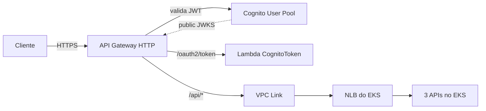

# API Gateway + VPC Link

> **Rótulo:** Referência
> **TL;DR:** API Gateway HTTP é a entrada única do sistema. Valida JWT no Cognito Authorizer e roteia para EKS via VPC Link ou direto para a Lambda CognitoToken.
> **Última revisão:** 2026-05-18

## Por que API Gateway HTTP (e não REST)

HTTP API é a última geração:

- **Custo menor** (~70% mais barato que REST API em chamadas similares).
- **JWT Authorizer nativo** para Cognito (em REST API exige Lambda Authorizer).
- **VPC Link nativo** para EKS/NLB.

Limitações aceitáveis: sem WAF integrado direto (TODO), sem cache nativo.

## Arquitetura

## Rotas

| Rota | Authorizer | Target |
|---|---|---|
| `POST /oauth2/token` | nenhum (público) | Lambda CognitoToken |
| `POST /api/ordens-de-servico` | Cognito JWT (`mechermes/admin`) | VPC Link → OS |
| `GET /api/ordens-de-servico/{id}` | Cognito JWT | VPC Link → OS |
| `POST /api/clientes` | Cognito JWT (`mechermes/admin`) | VPC Link → Cadastros |
| `POST /api/webhooks/orcamentos/{token}` | nenhum (HMAC) | VPC Link → Cadastros |
| `POST /api/webhooks/mercadopago` | nenhum (HMAC) | VPC Link → Pagamentos |
| `POST /api/pagamentos` | Cognito JWT (`mechermes/admin`) | VPC Link → Pagamentos |

## VPC Link

- Recurso AWS que permite o API Gateway alcançar recursos privados (NLB) dentro da VPC.
- Requer subnets privadas + security group permitindo tráfego do API Gateway.
- Provisionado pelo módulo `api-gateway/` do `mecanica-hermes-infra`.

## CloudWatch Logs

Logs do API Gateway vão para CloudWatch (Log Group `/aws/apigateway/mechermes-<env>`). Útil para depurar request/response sem precisar instrumentar os pods.

## Tarifa

A conta AWS Academy tem crédito limitado. O API Gateway HTTP cobra:

- **$1.00 / milhão de requests** (primeiro 300 milhões).

## Veja também

- [Autenticação Cognito + JWT](Autenticacao-Cognito-JWT)
- [Lambda CognitoToken](Lambda-CognitoToken)
- [Diagrama AWS completo](Diagrama-AWS-completo)
