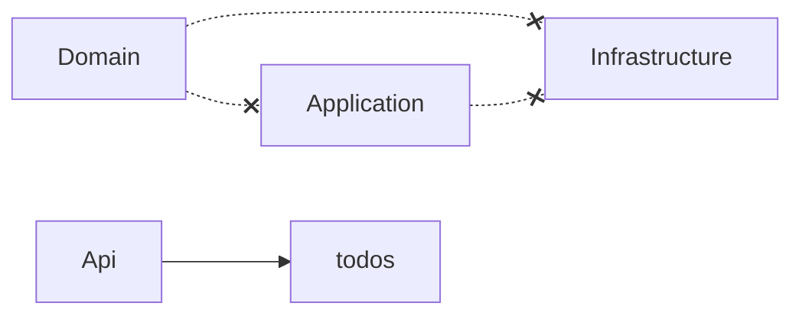

# Architecture Tests

> **Rótulo:** Referência
> **TL;DR:** NetArchTest valida em CI que as regras de dependência entre camadas não foram violadas.
> **Última revisão:** 2026-05-18

## O que validamos



- `Domain` **não** referencia `Application`, `Infrastructure`, `Api` ou bibliotecas externas pesadas (EF Core, MongoDB.Driver, MassTransit).
- `Application` **não** referencia `Infrastructure`, `Api`, EF Core, MongoDB.Driver.
- `Infrastructure` **pode** implementar interfaces de `Application` e mapear `Domain`.
- `Api` é o composition root — pode tudo.

## Exemplo (api-ordem-servico)

```csharp
public class ArchitectureTests
{
    [Fact]
    public void Domain_NaoDeveDependerDeInfrastructure()
    {
        var result = Types.InAssembly(typeof(OrdemDeServico).Assembly)
            .ShouldNot()
            .HaveDependencyOn("Mecanica.Hermes.Infrastructure")
            .GetResult();

        result.IsSuccessful.Should().BeTrue(
            because: $"Tipos que violam: {string.Join(", ", result.FailingTypeNames ?? [])}");
    }

    [Fact]
    public void Application_NaoDeveReferenciarEFCore()
    {
        var result = Types.InAssembly(typeof(CreateOrdemCommand).Assembly)
            .ShouldNot()
            .HaveDependencyOnAny("Microsoft.EntityFrameworkCore")
            .GetResult();
        result.IsSuccessful.Should().BeTrue();
    }
}
```

## Quando atualizar

Se você **legitimamente** precisar mover algo de camada (raro), atualize **um teste só** (não o pacote inteiro). Adicione comentário explicando a intenção.

Se a violação foi acidental, **não relaxe o teste** — corrija o código.

## Veja também

- [Clean Architecture + DDD + CQRS](Clean-Architecture-DDD-CQRS)
- [Estratégia de testes](Estrategia-de-testes)
