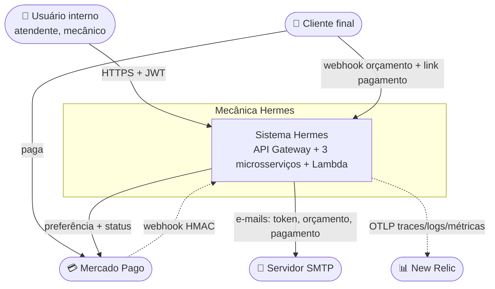

# Arquitetura — Visão geral (C4 nível 1)

> **Rótulo:** Explicação
> **TL;DR:** Diagrama de contexto do sistema Mecânica Hermes — quem fala com quem em alto nível.
> **Última revisão:** 2026-05-18

## Resumo

A Mecânica Hermes é um **sistema backend distribuído** que atende uma oficina mecânica. É acessado por usuários internos (atendente, mecânico) e externos (cliente final, via webhook e link de pagamento), e integra com dois sistemas externos críticos: **Mercado Pago** (gateway de pagamento) e um **servidor SMTP** (envio de e-mails).

O observador externo da plataforma deve enxergar **uma única entrada HTTPS** (o API Gateway com Cognito), atrás da qual existe uma malha de microsserviços.

## C4 nível 1 — Contexto

## Quem está envolvido

| Ator/sistema | Tipo | Como interage |
|---|---|---|
| **Usuário interno** | Pessoa | Chama endpoints REST autenticados via JWT (escopo `mechermes/admin`) |
| **Cliente final** | Pessoa | Recebe e-mails (token de login, orçamento, link de pagamento); clica em webhook assinado; paga pelo MP |
| **Mercado Pago** | Sistema externo | Recebe POST de preferência, envia webhook HMAC, responde polling de status |
| **Servidor SMTP** | Sistema externo | Envia e-mails transacionais para clientes |
| **New Relic** | Observabilidade | Recebe traces, métricas e logs via OTLP |

## Próximos níveis

- [Contêineres (C4 nível 2)](Conteineres) — zoom para os 3 microsserviços, bancos e mensageria.
- [Componentes por serviço (C4 nível 3)](Componentes-por-servico) — zoom para a estrutura interna de cada API.

## Padrões transversais

Independente do serviço, todo o ecossistema .NET segue o mesmo conjunto de padrões:

- [Clean Architecture + DDD + CQRS](Clean-Architecture-DDD-CQRS)
- [Result Pattern](Result-Pattern)
- [State Pattern](State-Pattern)
- [SAGA com MassTransit](SAGA-com-MassTransit)
- [Outbox transacional](Outbox-transacional)
- [Idempotência cross-service](Idempotencia-cross-service)
- [DLQ observability](DLQ-observability)
