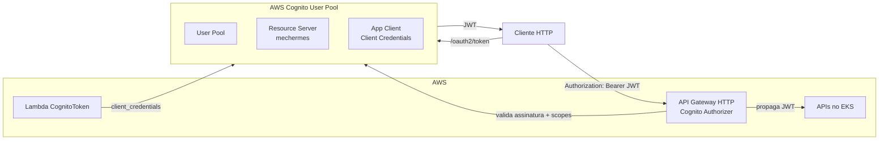

# Autenticação Cognito + JWT

> **Rótulo:** Explicação
> **TL;DR:** Autenticação via AWS Cognito com OAuth2 Client Credentials. Todas as APIs validam JWT no API Gateway (em produção) e/ou no middleware (interno).
> **Última revisão:** 2026-05-18

## Componentes



## Endpoints OAuth2

Domínio Cognito: `mechermes-<env>.auth.us-east-1.amazoncognito.com`.

| Endpoint | Fluxo |
|---|---|
| `POST /oauth2/token` (form: `grant_type=client_credentials`) | Server-to-server. Retorna JWT |
| `GET /oauth2/userInfo` | Não usado (não temos usuários humanos com login próprio) |

## Scopes

Definidos no **Resource Server** `mechermes`:

| Scope | Significado |
|---|---|
| `mechermes/admin` | Endpoints de mutação (criar OS, avançar etapa, adicionar produto) |
| `mechermes/client` | Endpoints de leitura para clientes (consulta da própria OS) |
| `servico-scope` | M2M entre serviços (Pagamentos → Cadastros) |

Ver [Autorização por scopes](Autorizacao-por-scopes) para o mapeamento scope → política.

## Como obter um JWT (machine)

```bash
CLIENT_ID=$(aws secretsmanager get-secret-value --secret-id mechermes-prd-cognito-client-secret | jq -r '.SecretString | fromjson | .client_id')
CLIENT_SECRET=$(aws secretsmanager get-secret-value --secret-id mechermes-prd-cognito-client-secret | jq -r '.SecretString | fromjson | .client_secret')
DOMAIN=$(aws secretsmanager get-secret-value --secret-id mechermes-prd-cognito-client-secret | jq -r '.SecretString | fromjson | .domain')

curl -X POST "https://${DOMAIN}/oauth2/token" \
  -H "Content-Type: application/x-www-form-urlencoded" \
  -d "grant_type=client_credentials&client_id=${CLIENT_ID}&client_secret=${CLIENT_SECRET}&scope=mechermes/admin"
```

Resposta:

```json
{
  "access_token": "eyJhbGciOiJSUzI1NiIs...",
  "expires_in": 3600,
  "token_type": "Bearer"
}
```

## Como obter um JWT (cliente final por CPF)

O cliente não tem `client_secret`. Ele envia o **CPF** para a Lambda, que valida o cadastro no banco e gera o JWT em nome dele. Token vai por e-mail.

Ver [Lambda CognitoToken](Lambda-CognitoToken).

## Validação no API Gateway

O API Gateway HTTP tem **Cognito JWT Authorizer** atrelado às rotas:

- Valida `iss` (issuer URL do User Pool).
- Valida assinatura via JWKS.
- Valida `exp` (não expirado).
- Valida `scope` se a rota exigir.

Se inválido, retorna 401 antes de chegar à API.

## Validação nas APIs (interno)

As 3 APIs também fazem validação local via `JwtBearerOptions.Authority`. Última linha de defesa caso alguém chame direto via VPC Link.

## Bypass em DEV/Testing

Em `Development` e `Testing`, o `DevelopmentAuthenticationMiddleware` (do SDK) injeta uma identidade default e bypassa a validação JWT. Permite testes locais sem precisar configurar Cognito.

## Veja também

- [Autorização por scopes](Autorizacao-por-scopes)
- [M2M Client Credentials](M2M-Client-Credentials)
- [Cognito](Cognito-User-Pool)
- [Lambda CognitoToken](Lambda-CognitoToken)
