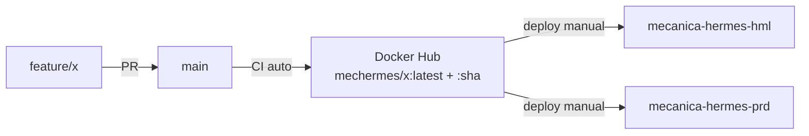

# Branching e ambientes

> **Rótulo:** Referência
> **TL;DR:** `main` é a única branch protegida. CI publica `:latest` no Docker Hub a cada merge. Deploy hml/prd é **manual**.
> **Última revisão:** 2026-05-18

## Branches

| Branch | Propósito |
|---|---|
| `main` | Código estável + apto a produção. Protegida. |
| `feature/<descricao>` | Trabalho ativo, sai de `main` e volta a `main` via PR. |
| `fix/<descricao>` | Correção de bug. Mesmo workflow. |
| `chore/<descricao>` | Build, deps, infra. Mesmo workflow. |

**Não usamos** `develop`, `staging` ou afins. A diferença entre ambientes é **a tag de imagem deployada**, não a branch.

## Pipeline



## Tags de imagem

A cada merge em `main`, o workflow `Build and Publish Docker Image` publica:

- `mechermes/<servico>:latest`
- `mechermes/<servico>:<sha-curto>`

Para fixar uma versão no deploy:

```yaml
# workflow API - Deploy do repo k8s
inputs:
  image_tag: ghi789a  # SHA curto
```

## Promoção entre ambientes

1. Merge em `main` → imagem `:latest` publicada.
2. Deploy em **hml** via `API - Deploy` (input `environment=hml`).
3. Validar em hml.
4. Deploy em **prd** via `API - Deploy` (input `environment=prd`, `image_tag=<sha-validado>`).

Não existe "auto-promote". Cada deploy é deliberado.

## Branch protection

- `main` requer PR aprovado por 1+ reviewer.
- Status checks obrigatórios: build, test, sonar, format.
- `Force push` desabilitado.

## Veja também

- [Como contribuir](Como-contribuir)
- [Pipelines GitHub Actions](Pipelines-GitHub-Actions)
- [Cluster Kubernetes](Cluster-Kubernetes)
