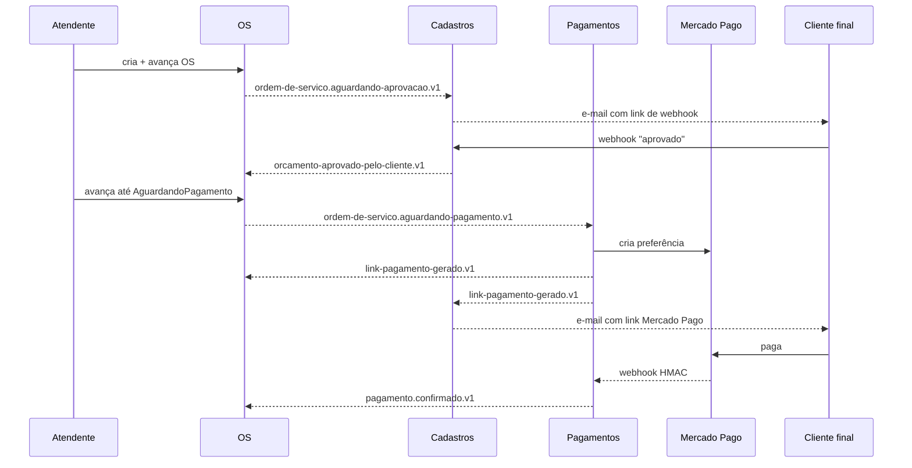

# Catálogo de eventos `.v1`

> **Rótulo:** Referência
> **TL;DR:** Os **7 contratos** de eventos que circulam pelo RabbitMQ entre OS, Cadastros e Pagamentos. Esta é a página **canonica** — toda mudança passa por aqui primeiro.
> **Última revisão:** 2026-05-18

## Resumo

7 eventos versionados via `[EntityName(".v1")]` (kebab-case). Os contratos vivem no pacote NuGet **`Mecanica.Hermes.Contracts`** ([SDK — Visão dos 6 pacotes](SDK-Visao-dos-6-pacotes)) e são consumidos pelos 3 serviços.

## Tabela canônica

| `EntityName` | Publisher | Consumer(s) | Quando é publicado |
|---|---|---|---|
| `ordem-de-servico.aguardando-aprovacao.v1` | **OS** | Cadastros | OS entra em `AguardandoAprovacao` (saída de `EmDiagnostico`) |
| `orcamento-aprovado-pelo-cliente.v1` | **Cadastros** | OS | Cliente clicou em "aprovar" no webhook |
| `orcamento-rejeitado-pelo-cliente.v1` | **Cadastros** | OS | Cliente clicou em "rejeitar" no webhook |
| `ordem-de-servico.aguardando-pagamento.v1` | **OS** | Pagamentos | OS entra em `AguardandoPagamento` (saída de `ManutencaoFinalizada`) |
| `link-pagamento-gerado.v1` | **Pagamentos** | OS, Cadastros | Pagamento gerou link no MP (Cadastros envia e-mail; OS guarda link) |
| `pagamento.confirmado.v1` | **Pagamentos** | OS | Webhook ou polling confirmaram pagamento aprovado |
| `pagamento.recusado.v1` | **Pagamentos** | OS | Pagamento foi recusado ou expirou |

## Fluxo visual



## Schema de cada evento

Os records estão em `Mecanica.Hermes.Contracts/IntegrationEvents/` no SDK. Exemplo:

```csharp
[EntityName("ordem-de-servico.aguardando-aprovacao.v1")]
public record OrdemDeServicoAguardandoAprovacaoEvent(
    Guid OrdemDeServicoId,
    Guid ClienteId,
    decimal ValorTotal,
    DateTime OcorridoEm);
```

A forma do record é **contrato imutável** — ver [Versionamento de contratos](Versionamento-de-contratos) para a política.

## Convenções

- **`EntityName` em kebab-case** com sufixo `.v1`.
- **Sem `Event` no nome** do `EntityName` (já fica implícito por contexto).
- **`Id` do agregado-origem** sempre presente (`OrdemDeServicoId`, `PagamentoId`).
- **`OcorridoEm`** sempre presente (timestamp UTC quando o fato ocorreu).
- **Sem referências circulares** — cada evento é autocontido.

## Onde os eventos são publicados

Via **Outbox** (não direto pelo `IPublishEndpoint`):

1. Agregado levanta `DomainEvent` interno.
2. Mapper converte para o contrato `.v1` do SDK.
3. INSERT na tabela/coleção de Outbox na mesma transação.
4. Background service despacha.

Isso garante **at-least-once** mesmo com broker fora do ar.

## Onde os eventos são consumidos

Cada serviço tem consumers em `Application/<Agregado>/Consumers/Integration/`. Todos seguem o padrão de **verificar estado-fonte** antes de despachar à SAGA — ver [Idempotência cross-service](Idempotencia-cross-service).

## Filas

Nomes de fila derivados do consumer via `KebabCaseEndpointNameFormatter`. Exemplo:

```text
ordem-de-servico-aguardando-aprovacao-event-consumer (Cadastros)
orcamento-aprovado-pelo-cliente-event-consumer (OS)
link-pagamento-gerado-event-consumer (OS)
link-pagamento-gerado-event-consumer (Cadastros)  ← nome único por serviço
```

Ver [Filas, retry, redelivery](Filas-retry-redelivery) para a política padrão.

## Validar este catálogo

A suíte E2E valida indiretamente os 7 eventos:

| Evento | Validado em |
|---|---|
| `ordem-de-servico.aguardando-aprovacao.v1` | suite 01, 02, 03 |
| `orcamento-aprovado-pelo-cliente.v1` | suite 01, 02, 04 |
| `orcamento-rejeitado-pelo-cliente.v1` | suite 03 |
| `ordem-de-servico.aguardando-pagamento.v1` | suite 01, 02 |
| `link-pagamento-gerado.v1` | suite 01, 02 |
| `pagamento.confirmado.v1` | suite 01, 02 (2º pagamento) |
| `pagamento.recusado.v1` | suite 02, 05 |

No SDK há `IntegrationEventNamesTests` que falha se alguém renomear acidentalmente um `EntityName`.

## Veja também

- [Versionamento de contratos](Versionamento-de-contratos)
- [SDK — Visão dos 6 pacotes](SDK-Visao-dos-6-pacotes)
- [Idempotência cross-service](Idempotencia-cross-service)
