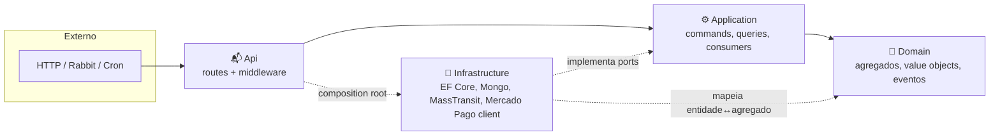
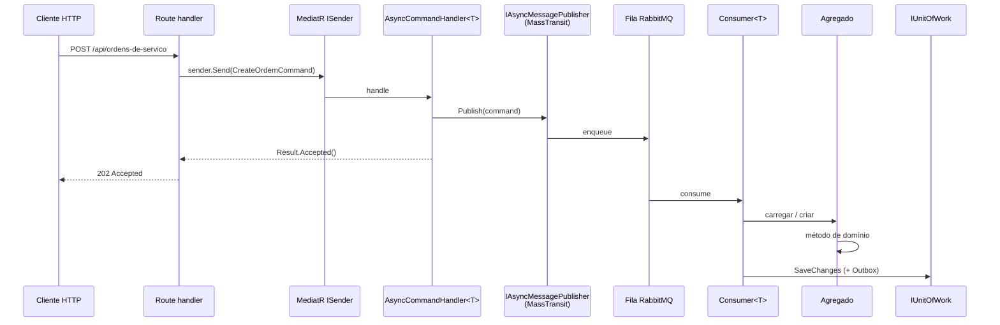

# Clean Architecture + DDD + CQRS

> **Rótulo:** Explicação
> **TL;DR:** Como organizamos cada serviço em camadas, com Domain isolado, Application orquestrando casos de uso, e Infrastructure cuidando de I/O.
> **Última revisão:** 2026-05-18

## Por que esses 3 padrões juntos

- **Clean Architecture** garante **regra de dependência** — o que muda raramente (regras de negócio) não depende do que muda com frequência (frameworks, drivers).
- **DDD** dá vocabulário para modelar regras complexas — agregados, value objects, eventos de domínio, bounded contexts.
- **CQRS** separa modelos de **leitura** e **escrita** — simplifica cada lado e habilita comandos assíncronos.

## Diagrama de camadas



## Projetos

No código, cada camada é um projeto `.csproj` separado:

```text
src/
  Mecanica.Hermes.<servico>.Domain/         # zero deps externas (além do SDK Core)
  Mecanica.Hermes.<servico>.Application/    # MediatR, MassTransit consumers
  Mecanica.Hermes.<servico>.Infrastructure/ # EF Core ou Mongo, drivers
  Mecanica.Hermes.<servico>.Api/            # ASP.NET Core Minimal API
```

## CQRS na prática

### Comandos (escrita) — assíncronos



O cliente recebe `202 Accepted` **imediatamente**, sem esperar o consumer concluir. A SAGA garante uma operação em voo por chave (ex.: `OrdemDeServicoId`). Ver [SAGA com MassTransit](SAGA-com-MassTransit).

### Queries (leitura) — síncronas

Query handlers chamam repositório direto e retornam `Result<T>` no mesmo ciclo HTTP. Sem mensageria.

## Repository Interface Segregation

Cada agregado tem 3 interfaces de repositório:

- `IOrdemDeServicoReader` — métodos de leitura.
- `IOrdemDeServicoWriter` — métodos de mutação.
- `IOrdemDeServicoRepository` — combina ambos.

Query handlers dependem só do `Reader` — garante em tempo de compilação que não haverá efeito colateral.

## Entity/Domain Split

Classes mapeadas pelo EF Core (ou Mongo) **não são** o agregado:

```text
Infrastructure/Persistence/Entities/
  OrdemDeServicoEntity.cs   # tem atributos do EF, schema, FKs

Domain/OrdensDeServico/
  OrdemDeServico.cs         # não tem nada de persistência
```

Mappers (extensões manuais; AutoMapper foi removido) convertem nos dois sentidos. Isso permite trocar o ORM sem tocar no domínio.

## NetArchTest

O projeto `ArchitectureTests` em cada serviço usa NetArchTest para falhar o CI se alguém violar:

- `Domain` referenciar `Infrastructure`.
- `Application` referenciar tipos do EF Core / Mongo.
- Endpoints fazerem `new` de agregados (devem passar pelo handler).

## Veja também

- [Componentes por serviço](Componentes-por-servico)
- [Result Pattern](Result-Pattern)
- [State Pattern](State-Pattern)
- [Architecture Tests](Architecture-Tests)
