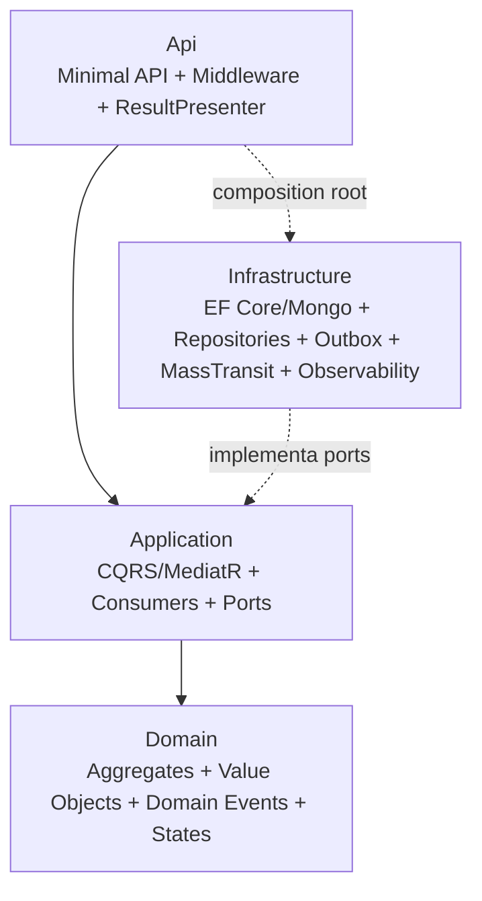

# Componentes por serviço (C4 nível 3)

> **Rótulo:** Explicação
> **TL;DR:** Estrutura interna (camadas e projetos) de cada uma das 3 APIs .NET.
> **Última revisão:** 2026-05-18

Todas as 3 APIs seguem **a mesma estrutura de camadas** — Clean Architecture + DDD + CQRS. As diferenças ficam nos agregados, no transport de persistência (Postgres vs Mongo) e nas integrações externas.

## Estrutura comum

Regra de dependência estrita (validada por `ArchitectureTests` com NetArchTest):

- `Domain` não conhece **nada** além de si.
- `Application` conhece apenas `Domain`.
- `Infrastructure` implementa interfaces de `Application` e conhece `Domain` (mapeia entity↔agregado).
- `Api` é o composition root — conhece todos.

## API Ordem de Serviço

| Projeto | Papel |
|---|---|
| `Mecanica.Hermes.Api` | Endpoints REST (Minimal API), middleware, `ResultPresenter`, OpenAPI/Scalar |
| `Mecanica.Hermes.Application` | Comandos/queries CQRS, MassTransit consumers, ports |
| `Mecanica.Hermes.Domain` | Agregado `OrdemDeServico`, sub-entidades, classes de status (State Pattern), `Result<T>` |
| `Mecanica.Hermes.Infrastructure` | EF Core (Postgres), repositórios, Outbox processor, SAGA MongoDB, MassTransit, OpenTelemetry |
| `Mecanica.Hermes.TestUtils` | Builders Bogus compartilhados |

Agregado: **`OrdemDeServico`** com state machine de 8 estados + 2 terminais (`Rejeitada`, `Cancelada`). Ver [Domínio de negócio](Dominio-de-negocio).

## API Cadastros

| Projeto | Papel |
|---|---|
| `Mecanica.Hermes.Cadastros.Api` | Endpoints REST, endpoint público de webhook |
| `Mecanica.Hermes.Cadastros.Application` | Comandos/queries, validators FluentValidation, consumers MassTransit |
| `Mecanica.Hermes.Cadastros.Domain` | Agregados `Cliente` (com veículos) e `Produto`, soft delete via `IsDeleted` |
| `Mecanica.Hermes.Cadastros.Infrastructure` | EF Core (Postgres), MailKit (SMTP), webhook handling, Outbox transacional próprio |

Dois agregados raiz: **`Cliente`** e **`Produto`**. Sem SAGA — puramente reativo. Particularidade: soft delete + índices únicos parciais (`Cpf`, `Email`, `Codigo`, `Nome` únicos só entre não-deletados).

## API Pagamentos

| Projeto | Papel |
|---|---|
| `Mecanica.Hermes.Pagamento.Api` | Endpoints REST + endpoint público `/api/webhooks/mercadopago` (HMAC) |
| `Mecanica.Hermes.Pagamento.Application` | Comandos/queries, consumers, ports |
| `Mecanica.Hermes.Pagamento.Domain` | Agregado `Pagamento`, classes de status, eventos |
| `Mecanica.Hermes.Pagamento.Infrastructure` | MongoDB.Driver, Outbox Mongo, SAGA Mongo, Mercado Pago client com Polly, M2M HTTP handler para Cadastros |

Agregado: **`Pagamento`** com state machine `PendenteGeracao → LinkGerado → AguardandoConfirmacao → {Pago | Recusado | Expirado}`. Reconciliação **dupla** (webhook HMAC + polling agendado).

## Compartilhamento

Os 3 serviços consomem o [SDK compartilhado](SDK-Visao-dos-6-pacotes) via GitHub Packages. Inclui `Result<T>`, `BaseDomain`, middlewares ASP.NET, behaviors MediatR, e os **7 contratos de evento `.v1`** ([Catálogo de eventos](Catalogo-de-eventos)).

## Veja também

- [Clean Architecture + DDD + CQRS](Clean-Architecture-DDD-CQRS)
- [SAGA com MassTransit](SAGA-com-MassTransit)
- [Outbox transacional](Outbox-transacional)
