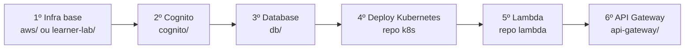

# Deploy em AWS

> **Rótulo:** Tutorial
> **TL;DR:** Visão geral dos 6 passos sequenciais para subir a Mecânica Hermes em AWS, do zero a `Entregue`.
> **Última revisão:** 2026-05-18

## A ordem importa

Provisionar do zero requer **6 passos em sequência**, distribuídos por 3 repositórios. Pular um quebra o seguinte.

## Os 6 passos

### Passo 1 — Infraestrutura base (Terraform)

Repositório: [`mecanica-hermes-infra`](https://github.com/fiap-challenge-13soat/mecanica-hermes-infra)
Workflow: `Learner Lab AWS - Terraform Create` **ou** `AWS - Terraform Create`
Módulo: `aws/` (ou `learner-lab/`)

Provisiona VPC, subnets, NAT Gateway, EKS Cluster (1.34) + Node Groups, Security Groups, S3 (tfstate), DynamoDB (locks).

Ver [Provisionamento (Terraform)](Provisionamento-Terraform).

### Passo 2 — Cognito (Terraform)

Repositório: `mecanica-hermes-infra`
Workflow: `Cognito - Terraform Create` (input: `environment`)
Módulo: `cognito/`

Provisiona User Pool, App Client (Client Credentials), Resource Server com scopes, Domain, Secrets Manager.

Ver [Cognito](Cognito-User-Pool).

### Passo 3 — Database (Terraform)

Repositório: `mecanica-hermes-infra`
Workflow: `Database - Terraform Create` (input: `environment`)
Módulo: `db/`

Provisiona RDS PostgreSQL 17.6 (`db.t4g.micro`), criptografia, backup 7 dias, snapshot final, acesso só pela VPC.

Ver [Bancos de dados](Bancos-de-dados).

### Passo 4 — Deploy Kubernetes (Kustomize)

Repositório: [`mecanica-hermes-k8s`](https://github.com/fiap-challenge-13soat/mecanica-hermes-k8s)
Workflow: `API - Deploy` (inputs: `environment`, `image_tag`)

Aplica Kustomize overlay em `hml` ou `prd`. Cria namespace, Secret, ConfigMap, Deployments, HPAs, Services LoadBalancer. Instala New Relic via Helm.

Ver [Cluster Kubernetes](Cluster-Kubernetes).

### Passo 5 — Lambda CognitoToken

Repositório: [`mecanica-hermes-lambda`](https://github.com/fiap-challenge-13soat/mecanica-hermes-lambda)
Workflow: `Deploy - Lambda Function` (input: `environment`)

Builda e publica a função, descobre infraestrutura (RDS, Cognito User Pool, App Client) automaticamente, cria/atualiza Secret consolidado.

Ver [Lambda CognitoToken](Lambda-CognitoToken).

### Passo 6 — API Gateway (Terraform)

Repositório: `mecanica-hermes-infra`
Workflow: `API Gateway - Terraform Create`
Módulo: `api-gateway/`

Provisiona API Gateway HTTP, Cognito Authorizer, VPC Link para o EKS, integração com Lambda, rotas com escopos JWT.

Ver [API Gateway + VPC Link](API-Gateway-VPC-Link).

## Destruir (ordem inversa)

6 → 5 → 4 → 3 → 2 → 1

> ⚠️ **Sempre destrua o Kubernetes (passo 4) antes da infra base (passo 1)** — senão, recursos órfãos de NLB, Security Groups e VPC Links impedem o destroy da VPC.

## Secrets de pipeline

Cada repo tem suas próprias Secrets no GitHub Actions:

| Secret | Repo(s) |
|---|---|
| `AWS_ACCESS_KEY_ID`, `AWS_SECRET_ACCESS_KEY`, `AWS_SESSION_TOKEN` | `infra`, `k8s`, `lambda` |
| `AWS_DEFAULT_REGION` | `infra`, `k8s`, `lambda` |
| `JWT_KEY`, `EMAIL_PASSWORD`, `NEW_RELIC_LICENSE_KEY` | `k8s`, `lambda` |
| `AWS_ACCOUNT_ID` | `infra` (só fluxo learner-lab) |

## Páginas relacionadas

- [Diagrama AWS completo](Diagrama-AWS-completo)
- [Pipelines GitHub Actions](Pipelines-GitHub-Actions)
- [Forçar limpeza de namespace](Forcar-limpeza-de-namespace) (se algo travar)
