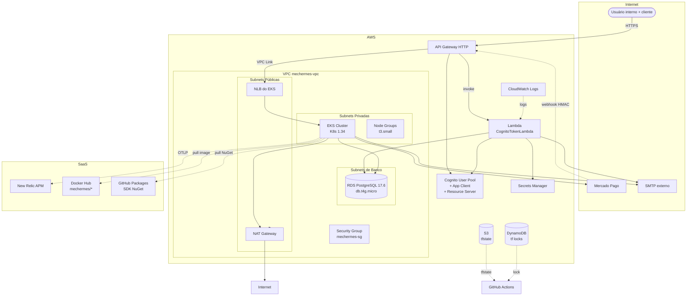

# Diagrama AWS completo

> **Rótulo:** Referência
> **TL;DR:** Todos os recursos AWS provisionados, em um único diagrama.
> **Última revisão:** 2026-05-18

## Diagrama

## Lista de recursos

### Rede

| Recurso | Quantidade | Onde é criado |
|---|---|---|
| VPC | 1 | `mecanica-hermes-infra/aws/` |
| Subnets públicas | 2 (multi-AZ) | `aws/` |
| Subnets privadas | 2 | `aws/` |
| Subnets de banco | 2 | `aws/` |
| NAT Gateway | 1 | `aws/` |
| Internet Gateway | 1 | `aws/` |
| Security Group `mechermes-sg` | 1 | `aws/` |

### Compute

| Recurso | Quantidade | Onde é criado |
|---|---|---|
| EKS Cluster | 1 por env | `aws/` |
| Node Group | 1 por env | `aws/` |
| Lambda CognitoToken | 1 por env | `mecanica-hermes-lambda` |

### Persistência

| Recurso | Quantidade | Onde é criado |
|---|---|---|
| RDS Postgres | 1 por env | `db/` |
| S3 bucket `mechermes-tf-state-aws` | 1 (global) | manual ou primeiro run |
| DynamoDB `mechermes-tf-locks` | 1 (global) | manual ou primeiro run |

### Identity & Secrets

| Recurso | Quantidade | Onde é criado |
|---|---|---|
| Cognito User Pool | 1 por env | `cognito/` |
| App Client (Client Credentials) | 1 por env | `cognito/` |
| Resource Server `mechermes` | 1 por env | `cognito/` |
| Cognito Domain | 1 por env | `cognito/` |
| Secret `mechermes-{env}-cognito-client-secret` | 1 por env | `lambda` deploy |
| Secret do RDS Master | 1 por env | `db/` (gerenciado pelo RDS) |

### Edge / Routing

| Recurso | Onde |
|---|---|
| API Gateway HTTP | `api-gateway/` |
| Cognito Authorizer | `api-gateway/` |
| VPC Link | `api-gateway/` |
| CloudWatch Log Group | `api-gateway/` |

## Veja também

- [Provisionamento (Terraform)](Provisionamento-Terraform)
- [Cluster Kubernetes](Cluster-Kubernetes)
- [API Gateway + VPC Link](API-Gateway-VPC-Link)
- [Cognito](Cognito-User-Pool)
