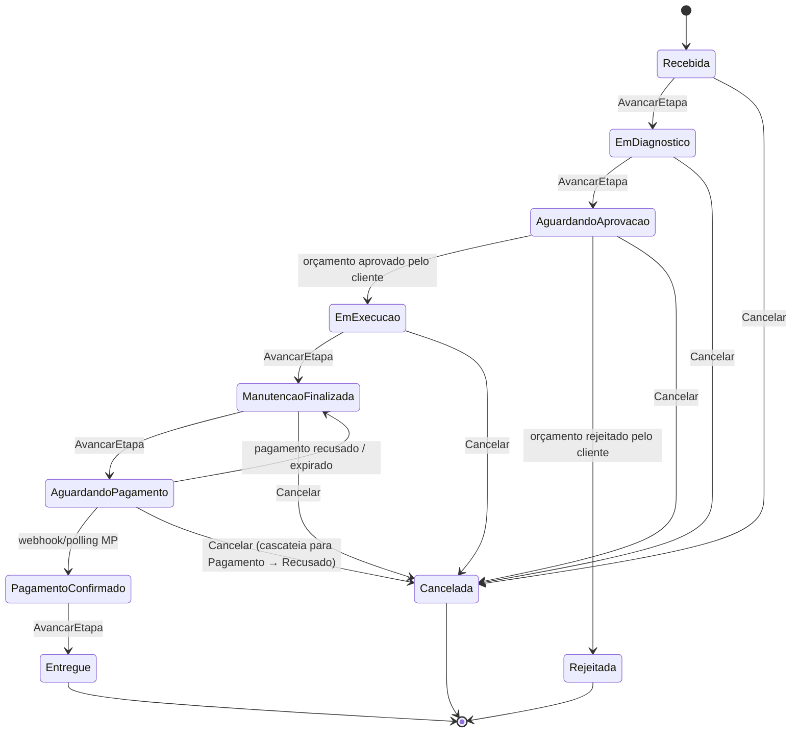

# Domínio de negócio

> **Rótulo:** Explicação
> **TL;DR:** Como funciona uma oficina mecânica no modelo Mecânica Hermes — do recebimento do veículo à entrega após pagamento.
> **Última revisão:** 2026-05-18

## Atores

| Ator | Papel |
|---|---|
| **Cliente** | Dono do veículo. Aprova/rejeita orçamento e paga via Mercado Pago. Recebe e-mails (token de login, orçamento, link de pagamento) |
| **Atendente** | Cria a Ordem de Serviço, registra o veículo, captura o problema relatado |
| **Mecânico** | Diagnostica, adiciona produtos/serviços ao orçamento, executa a manutenção |
| **Financeiro/Sistema** | Acompanha pagamento e libera a entrega |

## Conceitos-chave

- **Ordem de Serviço (OS)** — agregado central que representa todo o atendimento de um veículo, do recebimento à entrega. Identificada por `OrdemDeServicoId`.
- **Orçamento** — soma dos produtos (peças) + serviços (mão de obra) que compõem a OS antes da aprovação do cliente.
- **Produto** — peça do catálogo (com preço unitário). Quando adicionada à OS, o preço é **snapshot** — alterações no catálogo não retroagem.
- **Serviço** — item de mão de obra (com preço). Mesma regra de snapshot.
- **Cliente** — pessoa física identificada por CPF, com um ou mais veículos cadastrados.
- **Pagamento** — agregado próprio que gerencia o link Mercado Pago e a confirmação (webhook + polling).

## Ciclo de vida da Ordem de Serviço

## Como o cliente participa

1. **Cadastro inicial** — o atendente cria o cliente (CPF, nome, e-mail, endereço, veículos) no serviço de Cadastros.
2. **Login por CPF** — quando o cliente quer consultar o status, envia o CPF para o endpoint público; a Lambda gera um JWT via Cognito e envia o token por e-mail. Ver [Lambda CognitoToken](Lambda-CognitoToken).
3. **Aprovação de orçamento** — quando a OS chega em `AguardandoAprovacao`, o serviço de Cadastros gera um **token de webhook** único (expira em 7 dias) e envia o link por e-mail. O cliente clica e responde aprovado/rejeitado.
4. **Pagamento** — quando a OS chega em `AguardandoPagamento`, o serviço de Pagamentos gera um link Mercado Pago e envia por e-mail. O cliente paga pelo MP.
5. **Entrega** — após confirmação do pagamento, o atendente avança a OS para `Entregue`.

## O que cada serviço guarda

| Serviço | Agregados / entidades |
|---|---|
| **Ordem de Serviço** | `OrdemDeServico` (raiz), `OrdemDeServicoProduto`, `OrdemDeServicoServico`, `OrdemDeServicoHistoricoStatus` |
| **Cadastros** | `Cliente` (com lista de veículos), `Produto`, `webhook_link`, `webhook_events` |
| **Pagamentos** | `Pagamento` (raiz), `PagamentoHistoricoStatus`, `pagamento_outbox`, saga state |

## Regras de negócio importantes

- **Snapshot de preço** — produtos/serviços copiam seus preços no momento da inclusão na OS. Alterações no catálogo não afetam OS já criadas.
- **Edição condicional** — a propriedade `PermiteEditarProdutos` do estado da OS controla se é possível adicionar/remover itens. Após `EmExecucao`, o orçamento está congelado.
- **Soft delete em Cadastros** — clientes e produtos não são removidos fisicamente. Isso preserva referências históricas em OS antigas (sem FK cross-database) e habilita índices únicos parciais.
- **State machine vs CRUD** — OS e Pagamentos são state machines. Cadastros é CRUD com soft delete.
- **Cancelamento cascateia em alguns estados** — cancelar a OS em `AguardandoPagamento` recusa o pagamento via consumer cross-service.

## Páginas relacionadas

- [Catálogo de eventos](Catalogo-de-eventos) — como os 3 serviços conversam
- [Fluxo — Caminho feliz](Fluxo-Caminho-feliz) — passo a passo da OS feliz
- [State Pattern](State-Pattern) — implementação no código
