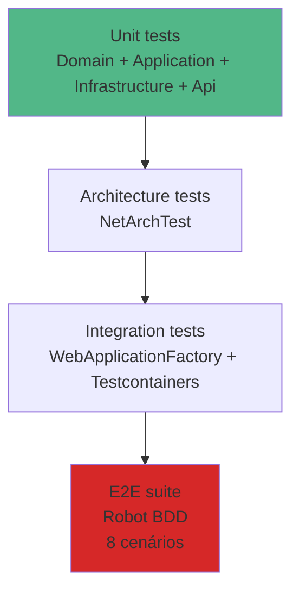

# Estratégia de testes

> **Rótulo:** Explicação
> **TL;DR:** Pirâmide clássica: muitos unitários, alguns de integração, poucos E2E. Architecture Tests garantem regras de dependência. Cobertura ≥ 80% no CI.
> **Última revisão:** 2026-05-18

## Pirâmide



## Projetos de teste por serviço

| Projeto | Tipo | Roda em CI |
|---|---|---|
| `Mecanica.Hermes.<svc>.Domain.Tests` | Unit puro (sem mock) | sim |
| `Mecanica.Hermes.<svc>.Application.Tests` | Unit com Moq + MassTransit.TestFramework | sim |
| `Mecanica.Hermes.<svc>.Infrastructure.Tests` | Unit + Testcontainers (Postgres/Mongo) | sim |
| `Mecanica.Hermes.<svc>.Api.Tests` | Unit (middleware, presenter, routes) | sim |
| `Mecanica.Hermes.<svc>.IntegrationTests` | Full HTTP stack via WebApplicationFactory + Testcontainers | sim |
| `Mecanica.Hermes.<svc>.ArchitectureTests` | NetArchTest | sim |
| `Mecanica.Hermes.<svc>.TestUtils` | builders Bogus compartilhados (não roda) | n/a |

## Convenções

- **Nome:** `MetodoOuCenario_DeveDoX_QuandoY`.
- **AAA** (Arrange, Act, Assert).
- **FluentAssertions** para `should()`.
- **Bogus** para builders (`OrdemDeServicoBuilder().Comprodutos(3).Build()`).
- **Moq** para mocks de Ports.
- **MassTransit.TestFramework `InMemoryTestHarness`** para consumers (sem Docker).
- **Espera determinística** com `harness.Published.Any<T>(ct)` em vez de `Task.Delay`.

## Testcontainers

Infra Tests e Integration Tests sobem containers descartáveis:

```csharp
await using var postgres = new PostgreSqlBuilder().Build();
await postgres.StartAsync();
```

Isso permite testar **migrations reais** e **índices parciais** sem precisar de banco pré-configurado.

## Cobertura

- **Limite mínimo:** 80% de linhas, enforced no CI.
- **Ferramenta:** Coverlet → OpenCover → SonarCloud.
- **Relatório HTML** com `reportgenerator`.

Comando:

```bash
dotnet test --settings coverlet.runsettings --results-directory .temp/coverage
reportgenerator -reports:.temp/coverage/**/coverage.opencover.xml -targetdir:.temp/coverage/report
```

## E2E

Ver [Testes E2E](Testes-E2E).

## Veja também

- [Cobertura e SonarCloud](Cobertura-e-SonarCloud)
- [Architecture Tests](Architecture-Tests)
- [Relatórios Allure](Relatorios-Allure)
