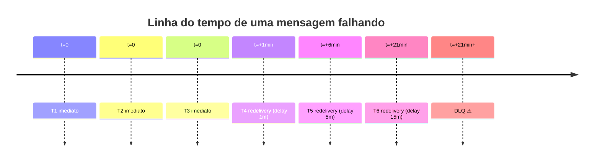

# Filas, retry e redelivery

> **Rótulo:** Referência
> **TL;DR:** Política padrão do MassTransit nos 3 serviços — 3 retries imediatos + 3 redeliveries exponenciais. ~21 minutos até DLQ. Plugin `rabbitmq_delayed_message_exchange` em dev local; em Amazon MQ ele **não é suportado** e o redelivery cai pra reentrega imediata.
> **Última revisão:** 2026-05-20

## Configuração padrão

Definida em `Infrastructure/MassTransit/BusFactoryConfiguratorExtensions.ConfigureCommonFactory`:

```csharp
cfg.UseMessageRetry(r => r.Immediate(3));
cfg.UseDelayedRedelivery(r => r.Intervals(
    TimeSpan.FromMinutes(1),
    TimeSpan.FromMinutes(5),
    TimeSpan.FromMinutes(15)));
```

## Cronólogo de tentativas



Total máximo: **~21 minutos** até a mensagem ir para a DLQ.

## Nomes de fila

Usamos `KebabCaseEndpointNameFormatter` — cada consumer gera uma fila com o nome do consumer em kebab-case:

| Consumer C# | Fila |
|---|---|
| `AdicionarProdutoConsumer` | `adicionar-produto` |
| `OrcamentoAprovadoConsumer` | `orcamento-aprovado` |
| `MercadoPagoWebhookConsumer` | `mercado-pago-webhook` |

Em caso de conflito entre serviços (ex.: ambos OS e Cadastros consomem `link-pagamento-gerado.v1`), MassTransit gera filas distintas porque o nome do consumer difere.

## Plugin delayed-message-exchange

O `UseDelayedRedelivery` requer o plugin **`rabbitmq_delayed_message_exchange`** instalado no RabbitMQ. Por isso usamos uma imagem Docker custom em dev local:

```dockerfile
FROM rabbitmq:4-management
RUN rabbitmq-plugins enable rabbitmq_delayed_message_exchange
```

A imagem custom está em `tests-e2e/docker-compose/services/rabbitmq/Dockerfile`.

### Em produção (Amazon MQ for RabbitMQ)

O plugin **não é suportado** ([matriz oficial AWS](https://docs.aws.amazon.com/amazon-mq/latest/developer-guide/rabbitmq-supported-plugins.html)). Sem ele:

- O `UseDelayedRedelivery` continua sendo chamado, mas internamente o MassTransit detecta a ausência do exchange `x-delayed-message` e **cai para reentrega imediata** — a mensagem volta pro topo da fila e o consumer reprocessa logo em seguida. O backoff exponencial (1m/5m/15m) é perdido em prod.
- Consequência prática: erros transientes que se resolveriam com o delay (ex.: Mercado Pago lento) podem disparar mais retries em curto espaço, aumentando carga. Mitigação aceitável dado o volume atual.

Para timeouts de SAGA (`.Schedule(...)`) o problema é diferente — cada serviço resolve com a sua estratégia de `IMessageScheduler`. Ver [Estratégia de scheduler por serviço](RabbitMQ#estratégia-de-scheduler-por-serviço).

## DLQ

Quando esgotam os retries, a mensagem vai para uma fila com sufixo `_error` (ex.: `adicionar-produto_error`). Não é reentregue automaticamente.

Ver [DLQ observability](DLQ-observability) para detecção.
Ver [Resposta a incidentes](Resposta-a-incidentes) para ações de replay.

## Excessões

### Polling de status do Mercado Pago

O consumer `VerificarStatusPagamentoConsumer` em Pagamentos não segue a política padrão — ele usa o `IMessageScheduler` para agendar a próxima verificação a cada 2 minutos. É um "timer distribuído" em vez de retry de falha. O scheduler é configurado como `cfg.UseInMemoryScheduler()` (não Quartz, porque o polling se reconcilia naturalmente). Ver [Estratégia de scheduler por serviço](RabbitMQ#estratégia-de-scheduler-por-serviço).

### Timeouts de SAGA em OS

A SAGA do `OrdemDeServicoStateMachine` agenda `OperationTimeout` (default 5min) para cancelar operações que não retornaram. Como o `IMessageScheduler` aqui é Quartz.NET (`cfg.UseMessageScheduler(new Uri("queue:quartz"))`) com `services.AddQuartz()` + `AddQuartzHostedService` no startup, os timeouts são enfileirados na fila interna `quartz` e disparados pelo `QuartzHostedService`. Trade-off: RAMJobStore (default) é não-durável — pod restart perde os timeouts pendentes.

### ConcurrencyConflictException

Quando um consumer encontra conflito otimista, MassTransit considera erro retriável — a próxima tentativa lê o estado atualizado e prossegue. **Esperado** em alta concorrência, não gera alarme.

## Veja também

- [SAGA com MassTransit](SAGA-com-MassTransit)
- [DLQ observability](DLQ-observability)
- [RabbitMQ](RabbitMQ)
