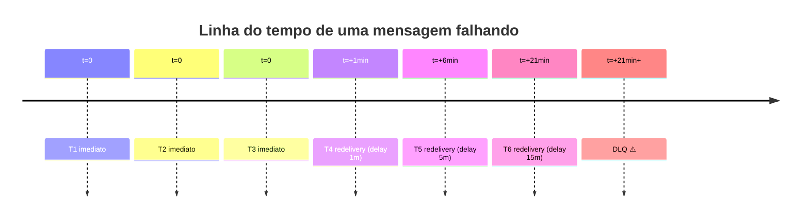

# Filas, retry e redelivery

> **Rótulo:** Referência
> **TL;DR:** Política padrão do MassTransit nos 3 serviços — 3 retries imediatos + 3 redeliveries exponenciais. ~21 minutos até DLQ.
> **Última revisão:** 2026-05-18

## Configuração padrão

Definida em `Infrastructure/MassTransit/BusFactoryConfiguratorExtensions.ConfigureCommonFactory`:

```csharp
cfg.UseMessageRetry(r => r.Immediate(3));
cfg.UseDelayedRedelivery(r => r.Intervals(
    TimeSpan.FromMinutes(1),
    TimeSpan.FromMinutes(5),
    TimeSpan.FromMinutes(15)));
```

## Cronólogo de tentativas



Total máximo: **~21 minutos** até a mensagem ir para a DLQ.

## Nomes de fila

Usamos `KebabCaseEndpointNameFormatter` — cada consumer gera uma fila com o nome do consumer em kebab-case:

| Consumer C# | Fila |
|---|---|
| `AdicionarProdutoConsumer` | `adicionar-produto` |
| `OrcamentoAprovadoConsumer` | `orcamento-aprovado` |
| `MercadoPagoWebhookConsumer` | `mercado-pago-webhook` |

Em caso de conflito entre serviços (ex.: ambos OS e Cadastros consomem `link-pagamento-gerado.v1`), MassTransit gera filas distintas porque o nome do consumer difere.

## Plugin delayed-message-exchange

O `UseDelayedRedelivery` requer o plugin **`rabbitmq_delayed_message_exchange`** instalado no RabbitMQ. Por isso usamos uma imagem Docker custom:

```dockerfile
FROM rabbitmq:4-management
RUN rabbitmq-plugins enable rabbitmq_delayed_message_exchange
```

A imagem custom está em `tests-e2e/docker-compose/services/rabbitmq/Dockerfile`.

## DLQ

Quando esgotam os retries, a mensagem vai para uma fila com sufixo `_error` (ex.: `adicionar-produto_error`). Não é reentregue automaticamente.

Ver [DLQ observability](DLQ-observability) para detecção.
Ver [Resposta a incidentes](Resposta-a-incidentes) para ações de replay.

## Excessões

### Polling de status do Mercado Pago

O consumer `VerificarStatusPagamentoConsumer` em Pagamentos não segue a política padrão — ele usa o `IMessageScheduler` para agendar a próxima verificação a cada 2 minutos. É um "timer distribuído" em vez de retry de falha.

### ConcurrencyConflictException

Quando um consumer encontra conflito otimista, MassTransit considera erro retriável — a próxima tentativa lê o estado atualizado e prossegue. **Esperado** em alta concorrência, não gera alarme.

## Veja também

- [SAGA com MassTransit](SAGA-com-MassTransit)
- [DLQ observability](DLQ-observability)
- [RabbitMQ](RabbitMQ)
