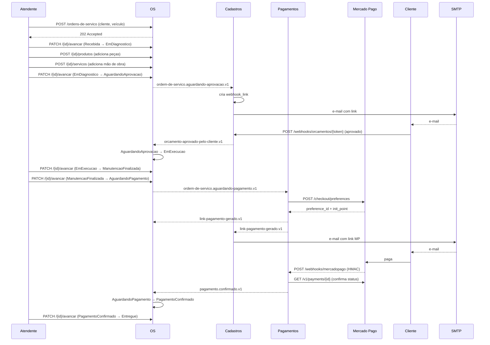

# Fluxo — Caminho feliz

> **Rótulo:** Explicação
> **TL;DR:** Da chegada do veículo à entrega após pagamento aprovado, sem desvios.
> **Suíte E2E:** `tests/suites/01__caminho_feliz.robot`
> **Última revisão:** 2026-05-18

## Cenário

Cliente leva o carro à oficina. Atendente abre OS. Mecânico monta orçamento. Cliente aprova por webhook. Manutenção concluída. Cliente paga pelo Mercado Pago. Carro é entregue.

## Sequência

## Estados percorridos

| Etapa | OS | Pagamento |
|---|---|---|
| 1 | `Recebida` | — |
| 2 | `EmDiagnostico` | — |
| 3 | `AguardandoAprovacao` | — |
| 4 | `EmExecucao` | — |
| 5 | `ManutencaoFinalizada` | — |
| 6 | `AguardandoPagamento` | `PendenteGeracao` → `LinkGerado` → `AguardandoConfirmacao` |
| 7 | `PagamentoConfirmado` | `Pago` |
| 8 | `Entregue` | `Pago` (terminal) |

## Eventos publicados

1. `ordem-de-servico.aguardando-aprovacao.v1` (OS → Cadastros)
2. `orcamento-aprovado-pelo-cliente.v1` (Cadastros → OS)
3. `ordem-de-servico.aguardando-pagamento.v1` (OS → Pagamentos)
4. `link-pagamento-gerado.v1` (Pagamentos → OS + Cadastros)
5. `pagamento.confirmado.v1` (Pagamentos → OS)

## Veja também

- [Catálogo de eventos](Catalogo-de-eventos)
- [Domínio de negócio](Dominio-de-negocio)
- [Fluxo — Pagamento cancelado e recriado](Fluxo-Pagamento-cancelado-recriado) — a variação mais comum
