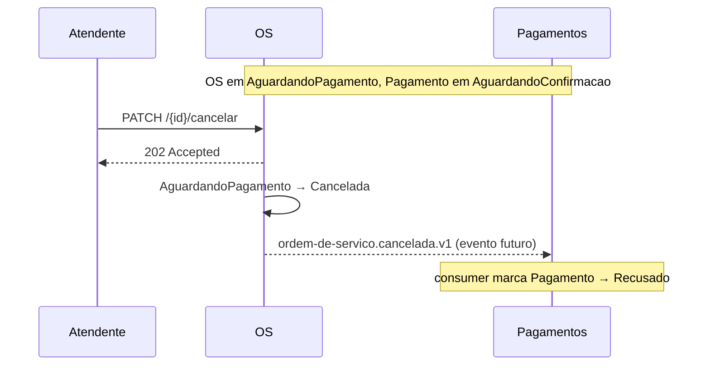

# Fluxo — Cancelamento em aguardando pagamento

> **Rótulo:** Explicação
> **TL;DR:** Operador cancela a OS enquanto ela está `AguardandoPagamento`. Como o Pagamento já foi criado, o cancelamento **cascateia** — o Pagamento vai para `Recusado` via consumer cross-service.
> **Suíte E2E:** `tests/suites/08__cancelamento_em_aguardando_pagamento.robot`
> **Última revisão:** 2026-05-18

## Cenário

Cliente desistiu do serviço após receber o link de pagamento. Operador cancela. Como o Pagamento já foi criado e tem link MP ativo, ele precisa ser marcado como `Recusado` (para não ficar pendente indefinidamente no polling).

## Sequência

## Notas

- Hoje a cascata está implementada via mecanismo interno (mesmo `pagamento.recusado.v1` que cobre os outros cenários). O evento `ordem-de-servico.cancelada.v1` está planejado como `.v2` futura para deixar a intenção explícita.
- O Pagamento `Recusado` também **invalida o link MP** (chama API de cancelamento da preferência).

## Estados percorridos

| Etapa | OS | Pagamento |
|---|---|---|
| antes | `AguardandoPagamento` | `AguardandoConfirmacao` |
| depois | `Cancelada` | `Recusado` |

## Veja também

- [Fluxo — Cancelamento em execução](Fluxo-Cancelamento-em-execucao) (variante sem cascata)
- [Idempotência cross-service](Idempotencia-cross-service)
