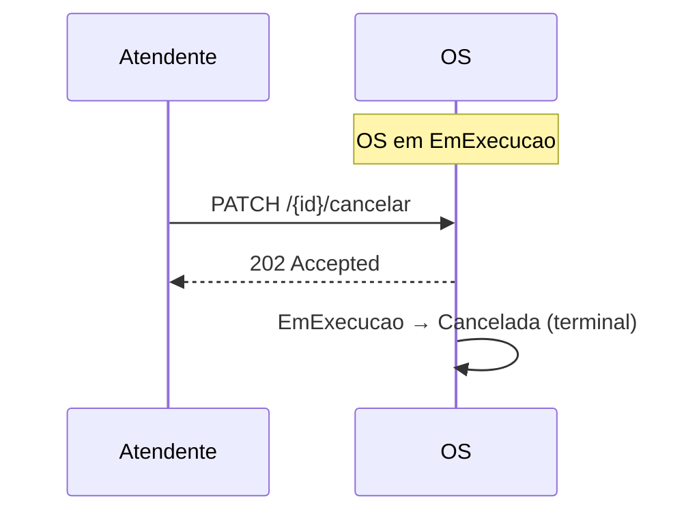

# Fluxo — Cancelamento em execução

> **Rótulo:** Explicação
> **TL;DR:** Operador cancela a OS enquanto ela está `EmExecucao`. OS vai para `Cancelada` (terminal). Sem cascata cross-service.
> **Suíte E2E:** `tests/suites/04__cancelamento_em_execucao.robot`
> **Última revisão:** 2026-05-18

## Cenário

Mecânico identifica problema mais grave durante a execução e decide cancelar a OS atual (será reaberta como uma nova). Operador chama `PATCH /{id}/cancelar`.

Nenhum pagamento foi criado ainda (o cancelamento ocorre antes de `AguardandoPagamento`), então não há cascata.

## Sequência

## Estados percorridos

| Etapa | OS |
|---|---|
| antes | `EmExecucao` |
| depois | `Cancelada` |

## Eventos publicados

Nenhum cross-service (a OS só publica eventos relevantes para Cadastros e Pagamentos em transições específicas, e `Cancelada` não é uma delas até estarmos em `AguardandoPagamento`).

## Veja também

- [State Pattern](State-Pattern)
- [Fluxo — Cancelamento em aguardando pagamento](Fluxo-Cancelamento-em-aguardando-pagamento) — a variante com cascata
