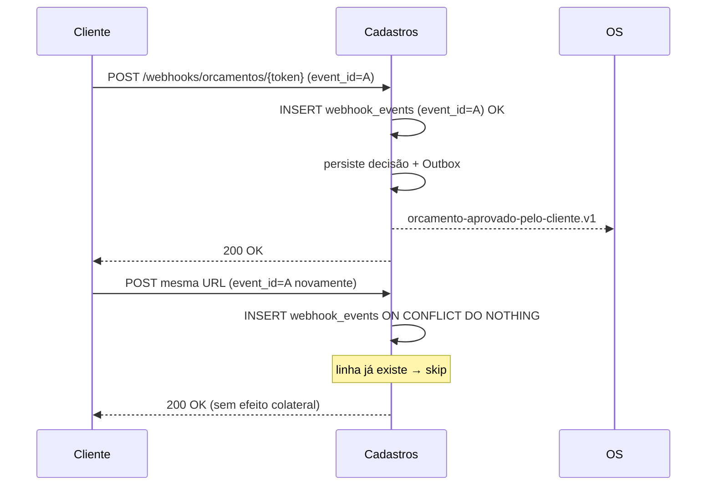

# Fluxo — Idempotência de webhook

> **Rótulo:** Explicação
> **TL;DR:** Webhook duplicado (cliente clica duas vezes, MP reenvia) é detectado por dedup e não avança a OS duas vezes.
> **Suíte E2E:** `tests/suites/06__webhook_idempotencia.robot`
> **Última revisão:** 2026-05-18

## Cenário

Usamos como exemplo o webhook de **orçamento**. Cliente clica em "Aprovar". O navegador reenvia (refresh, conexão lenta, dupla ação do usuário). O endpoint recebe **2 POSTs** com o **mesmo `webhook_event_id`**. Esperamos: OS avança uma vez só, segundo POST responde 200 OK sem reação.

## Sequência



## Camadas de defesa

Mesmo que dedup falhe, o **consumer da OS** verifica o estado-fonte antes de avançar:

```csharp
if (os.Status.Nome != "AguardandoAprovacao")
{
    _metrics.EventoIntegracaoIgnorado(...);
    return; // OS já avançou; skip
}
```

Então ainda que **dois eventos cheguem ao Rabbit**, a OS só transita uma vez.

## Veja também

- [Webhooks assinados (HMAC)](Webhooks-assinados-HMAC)
- [Idempotência cross-service](Idempotencia-cross-service)
