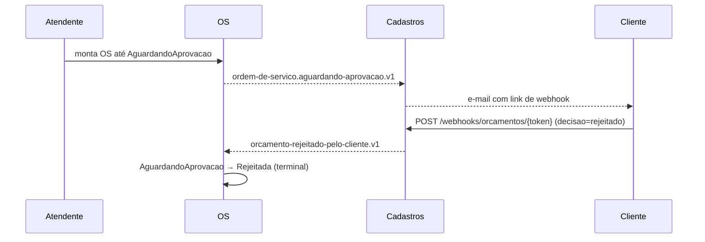

# Fluxo — Orçamento rejeitado

> **Rótulo:** Explicação
> **TL;DR:** Cliente rejeita o orçamento via webhook → OS vai para estado terminal `Rejeitada`.
> **Suíte E2E:** `tests/suites/03__orcamento_rejeitado.robot`
> **Última revisão:** 2026-05-18

## Cenário

Cliente recebe e-mail com orçamento, acha caro/desnecessário, clica em **"Rejeitar"** no webhook. OS encerra em estado terminal.

## Sequência

## Estados percorridos

| Etapa | OS |
|---|---|
| 1 | `Recebida` → `EmDiagnostico` → `AguardandoAprovacao` |
| 2 | `Rejeitada` (terminal) |

## Eventos publicados

1. `ordem-de-servico.aguardando-aprovacao.v1`
2. `orcamento-rejeitado-pelo-cliente.v1`

## Erros conhecidos

| Erro | Mitigação |
|---|---|
| Token expirou (7 dias) | Webhook responde 410 Gone; cliente deve solicitar novo orçamento |
| Cliente clica duas vezes (uma aprovar, outra rejeitar) | Idempotência por `webhook_event_id`; segunda chamada é ignorada |

## Veja também

- [Webhooks assinados (HMAC)](Webhooks-assinados-HMAC)
- [Fluxo — Idempotência de webhook](Fluxo-Idempotencia-de-webhook)
