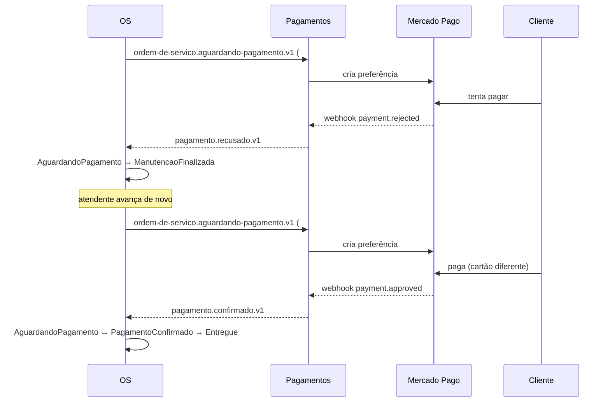

# Fluxo — Pagamento cancelado e recriado

> **Rótulo:** Explicação
> **TL;DR:** Primeiro pagamento é recusado (cartão negado). OS volta para `ManutencaoFinalizada`. Segundo pagamento aprovado conclui o fluxo.
> **Suíte E2E:** `tests/suites/02__pagamento_cancelado_recriado.robot`
> **Última revisão:** 2026-05-18

## Cenário

Cliente recebe link, tenta pagar com cartão A, MP recusa. OS reverte para `ManutencaoFinalizada` para que o atendente possa **gerar novo link de pagamento**. Cliente paga com cartão B, aprovado, fluxo termina.

## Sequência

## Estados percorridos

| Etapa | OS | Pagamento #1 | Pagamento #2 |
|---|---|---|---|
| 1 | `AguardandoPagamento` | `AguardandoConfirmacao` | — |
| 2 | `ManutencaoFinalizada` | `Recusado` (terminal) | — |
| 3 | `AguardandoPagamento` | `Recusado` | `AguardandoConfirmacao` |
| 4 | `PagamentoConfirmado` → `Entregue` | `Recusado` | `Pago` |

## Eventos publicados

1. `ordem-de-servico.aguardando-pagamento.v1` (1ª vez)
2. `link-pagamento-gerado.v1`
3. `pagamento.recusado.v1`
4. `ordem-de-servico.aguardando-pagamento.v1` (2ª vez)
5. `link-pagamento-gerado.v1`
6. `pagamento.confirmado.v1`

## Resiliência

O consumer `pagamento.recusado.v1` na OS verifica que o estado-fonte é `AguardandoPagamento` antes de reverter (ver [Idempotência cross-service](Idempotencia-cross-service)). Isso evita reverter a OS que já saiu desse estado por outro motivo.

## Veja também

- [Fluxo — Caminho feliz](Fluxo-Caminho-feliz)
- [Idempotência cross-service](Idempotencia-cross-service)
