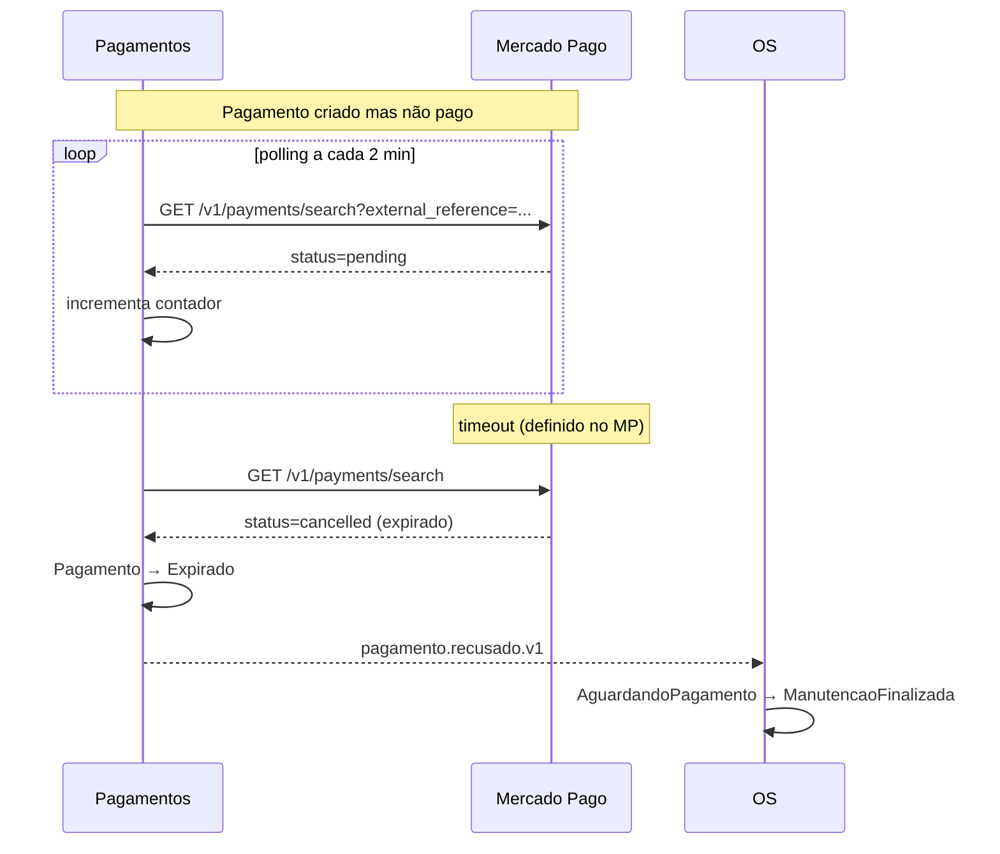

# Fluxo — Pagamento expirado

> **Rótulo:** Explicação
> **TL;DR:** Cliente não paga dentro do prazo do MP. Pagamento expira por timeout. OS volta para `ManutencaoFinalizada`.
> **Suíte E2E:** `tests/suites/05__pagamento_expirado.robot`
> **Última revisão:** 2026-05-18

## Cenário

Cliente recebe link mas não paga. O Mercado Pago expira a preferência. O polling agendado da SAGA de Pagamentos detecta status `cancelled`/`expired` e marca `Expirado`. OS é notificada e volta para `ManutencaoFinalizada` (mesmo comportamento do `Recusado`).

## Sequência

## Notas

- A SAGA de Pagamentos limita o número de verificações de polling (`LimiteVerificacoes`, default 30). Atingindo o limite sem confirmação, marca `Expirado`.
- Usamos o mesmo evento `pagamento.recusado.v1` para `Recusado` e `Expirado` — do ponto de vista da OS, ambos resultam em **reverter** o estado.

## Eventos publicados

1. `ordem-de-servico.aguardando-pagamento.v1`
2. `link-pagamento-gerado.v1`
3. `pagamento.recusado.v1` (com motivo `Expirado` no payload, se quiser distinguir em log)

## Veja também

- [SAGA com MassTransit](SAGA-com-MassTransit)
- [Fluxo — Pagamento cancelado e recriado](Fluxo-Pagamento-cancelado-recriado)
