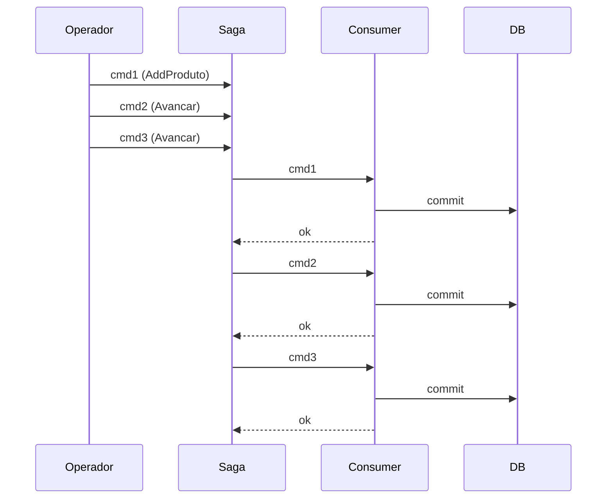

# Fluxo — Proteção por timeout da SAGA

> **Rótulo:** Explicação
> **TL;DR:** Comandos encadeados em alta velocidade na mesma OS são serializados pela SAGA — nunca processados em paralelo, mesmo sob carga.
> **Suíte E2E:** `tests/suites/07__saga_timeout_protection.robot`
> **Última revisão:** 2026-05-18

## Cenário

Operador (ou bug em frontend) dispara 3 comandos para a mesma OS em ~100ms:

```
POST /{id}/produtos
PATCH /{id}/avancar
PATCH /{id}/avancar
```

Sem SAGA, esses comandos poderiam ser processados em ordem não-determinística (3 consumers concorrentes), causando bugs sutis (avançar antes do produto ser adicionado, por exemplo).

Com SAGA, os 3 comandos são **enfileirados em série** por `OrdemDeServicoId`, e cada um espera o anterior terminar.

## Sequência esperada



A chave é a **CorrelationId** da SAGA ser o `OrdemDeServicoId`. MassTransit garante que **só 1 instance** da saga existe por chave — todos os comandos para essa OS passam por essa instance, em série.

## Sentinel de timeout

A SAGA define um **timeout sentinel** — se um consumer travar (deadlock, dependência parada), a saga marca timeout após tempo determinado. Em vez de deixar a OS "travada para sempre" sob lock saga, o timeout libera o lock e a mensagem vai para retry.

O timeout é conservador (alguns minutos) — nunca menor que o tempo máximo de processamento esperado de um consumer.

## Veja também

- [SAGA com MassTransit](SAGA-com-MassTransit)
- [Filas, retry, redelivery](Filas-retry-redelivery)
