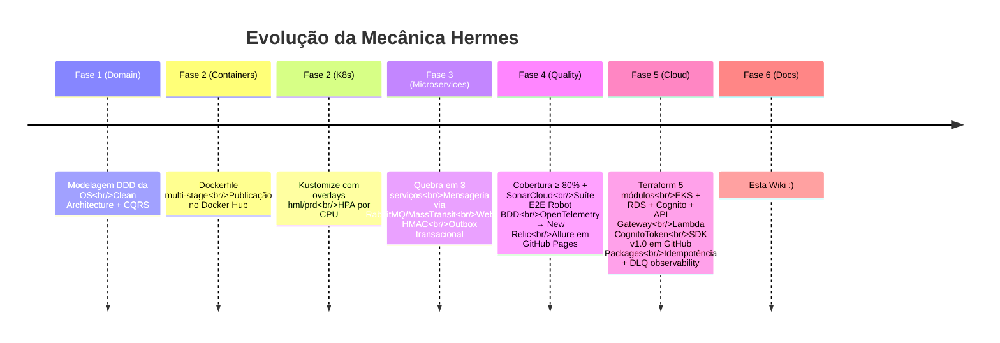

# Histórico cronológico

> **Rótulo:** Referência
> **TL;DR:** Eventos relevantes na evolução do projeto Mecânica Hermes, em ordem cronológica.
> **Última revisão:** 2026-05-18

## Linha do tempo

## Eventos relevantes

| Data aprox. | Evento |
|---|---|
| Início | Repositório mono-API com .NET 8 + Postgres |
| Mid | Migração para .NET 10 |
| Mid | Adiciona MassTransit + SAGA |
| Mid | Quebra em 3 serviços (OS, Cadastros, Pagamentos) |
| Mid | Migração de Cadastros para Postgres 18 |
| Mid | Migração de Pagamentos para Mongo + replica set |
| Mid | Adiciona Outbox transacional |
| Mid | Adiciona idempotência cross-service nos 4 consumers de integração |
| Mid | Adiciona Lambda CognitoToken |
| Late | Cria repositório do SDK + adoação em Cadastros e Pagamentos |
| Late | E2E Robot Framework com Allure |
| Late | Cria repositório `mecanica-hermes-docs` para esta Wiki |
| 2026-05-18 | Plano editorial + esqueleto da Wiki |

_TODO: substituir "Mid/Late" por datas reais consultando o git log de cada repo._

## Eventos breaking (mensageria)

Nenhum até hoje. Todos os 7 eventos estão em `.v1`.

## Veja também

- [Tech Challenge — FIAP 13SOAT](Tech-Challenge-FIAP-13SOAT)
- [Índice de ADRs](Indice-de-ADRs)
