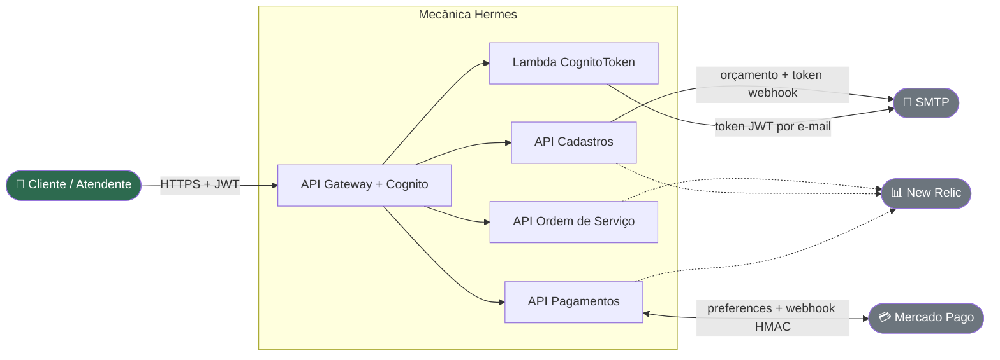

# 🔧 Mecânica Hermes

> **Backend distribuído para gestão de uma oficina mecânica.**
> Recebe veículos, monta orçamentos, recolhe a aprovação do cliente por e-mail/webhook, integra cobrança com Mercado Pago e devolve o carro ao cliente quando o pagamento é confirmado.
>
> Projeto desenvolvido pelo grupo do **Tech Challenge 13SOAT — FIAP**.

## Contexto em 1 diagrama

## Comece por aqui

Escolha a sua jornada:

| Você é... | Comece por |
|---|---|
| 🎓 **Avaliador / banca FIAP** | [Para avaliadores](Para-avaliadores) → [Tech Challenge — FIAP 13SOAT](Tech-Challenge-FIAP-13SOAT) → [Domínio de negócio](Dominio-de-negocio) → [Arquitetura](Arquitetura) |
| 👩‍💻 **Dev novo no time** | [Para devs novos](Para-devs-novos) → [Stack completa via Docker Compose](Stack-completa-via-Docker-Compose) → [Componentes por serviço](Componentes-por-servico) → [Como contribuir](Como-contribuir) |
| 🛠️ **Operador / SRE** | [Para operadores](Para-operadores) → [Runbook macro](Runbook-macro) → [Observabilidade](Observabilidade) |
| 🔌 **Integrador externo** | [Para integradores externos](Para-integradores-externos) → [Autenticação Cognito + JWT](Autenticacao-Cognito-JWT) → [API pública](API-publica) |

## O que tem aqui

A Wiki está organizada em 13 seções (veja o menu lateral). As mais consultadas:

- 🏛️ **[Arquitetura](Arquitetura)** — visão C4 do sistema e padrões transversais (Clean Architecture, SAGA, Outbox, State Pattern).
- 🔁 **[Fluxos de negócio](Fluxo-Caminho-feliz)** — os 8 cenários cobertos pela suíte E2E, descritos passo a passo.
- 📂 **[Repositórios](Repositorios)** — os 9 repos do ecossistema, seus papéis e como se conectam.
- 📨 **[Catálogo de eventos](Catalogo-de-eventos)** — os 8 contratos `.v1` que circulam no RabbitMQ.
- 🚨 **[Runbook macro](Runbook-macro)** — triagem inicial para incidentes cross-service.

## Status do projeto

| Serviço | Build / coverage |
|---|---|
| `api-ordem-servico` |   |
| `api-cadastros` |   |
| `api-pagamentos` |   |
| `api-sdk` |  |

_Cobertura mínima exigida pelo CI: **≥ 80%** de linhas em todos os serviços .NET._

## Sobre esta Wiki

Esta Wiki é mantida em arquivos Markdown versionados no repositório [`mecanica-hermes-docs`](https://github.com/fiap-challenge-13soat/mecanica-hermes-docs), seguindo o **[plano editorial](https://github.com/fiap-challenge-13soat/mecanica-hermes-docs/blob/main/WIKI-PLAN.md)**. Mudanças passam por Pull Request com revisão.

> **Última atualização:** 2026-05-19
