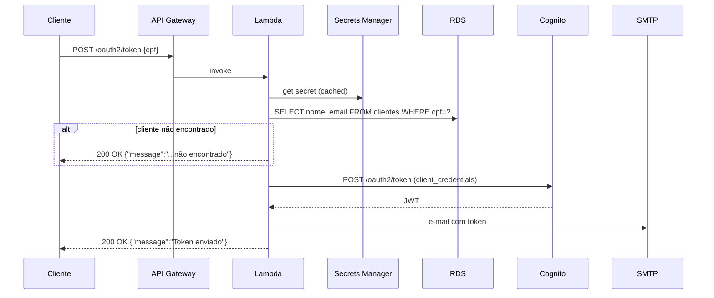

# Lambda CognitoToken

> **Rótulo:** Referência
> **TL;DR:** Cliente final envia CPF; Lambda valida no RDS, obtém JWT no Cognito, envia por e-mail.
> **Última revisão:** 2026-05-18

## Diagrama de sequência



## Request / Response

**Request:**

```json
{ "cpf": "511.253.630-61" }
```

**Sucesso:**

```json
{ "message": "O token foi gerado e enviado para seu e-mail cadastrado." }
```

**Falha (cliente não encontrado):**

```json
{ "message": "Não foi possível gerar o seu token. Erro: Cliente não encontrado para o CPF informado." }
```

A Lambda **não retorna 4xx/5xx para CPF não encontrado** — retorna 200 com mensagem genérica. Isso evita oracle de enumeração de CPFs válidos no sistema.

## Variáveis de ambiente principais

| Variável | Como é setada | Descrição |
|---|---|---|
| `RDS__Host`, `RDS__Port` | GitHub Actions descobre | Endpoint do RDS |
| `RDS__Database` | configurada | `mecanica_hermes_cadastros` |
| `RDS__Username` | configurada | `postgres` |
| `COGNITO_SECRET_ID` | configurada | `mechermes-<env>-cognito-client-secret` |
| `EmailSender__Enabled` | configurada | `true` em prod, `false` em testes |
| `EmailSender__SmtpServer`, `*__Port`, `*__UserName`, `*__Password` | secrets | Acesso SMTP |

A senha do RDS **não é** env var — vem dentro do secret consolidado do Cognito.

## Permissões IAM mínimas

```json
{
  "Version": "2012-10-17",
  "Statement": [
    {
      "Effect": "Allow",
      "Action": "secretsmanager:GetSecretValue",
      "Resource": "arn:aws:secretsmanager:*:*:secret:mechermes-*-cognito-client-secret-*"
    },
    {
      "Effect": "Allow",
      "Action": ["ec2:CreateNetworkInterface", "ec2:DescribeNetworkInterfaces", "ec2:DeleteNetworkInterface"],
      "Resource": "*"
    }
  ]
}
```

EC2 permissions são necessárias para a Lambda anexar ENI à VPC.

## Cold start

Típico: 1.5-3 segundos. Otimizações aplicadas:

- Npgsql direto (sem EF Core).
- `HttpClient`/`AmazonSecretsManagerClient` estáticos.
- 512 MB de memória (mais memória = mais CPU).
- Source-generated Regex.

## Veja também

- [Cognito](Cognito-User-Pool)
- [Repo: mecanica-hermes-lambda](Repo-mecanica-hermes-lambda)
- [Autenticação Cognito + JWT](Autenticacao-Cognito-JWT)
