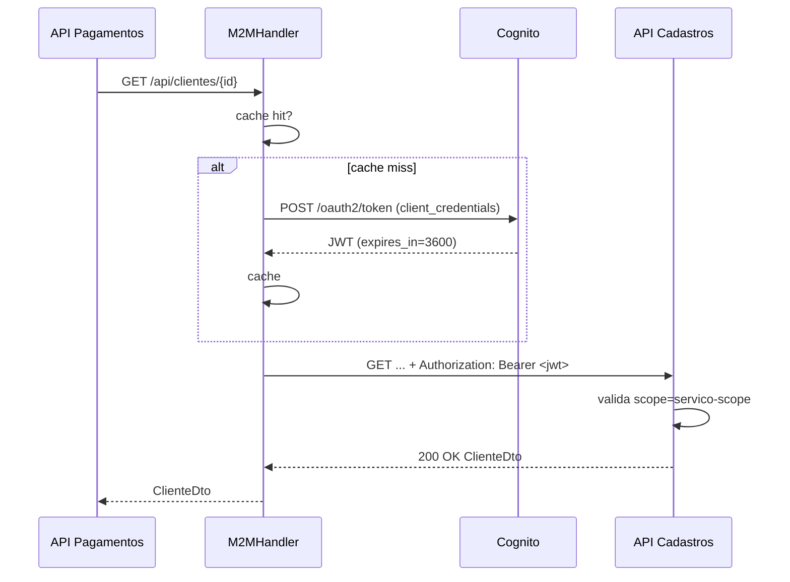

# M2M Client Credentials

> **Rótulo:** Explicação
> **TL;DR:** Pagamentos chama `GET /api/clientes/{id}` em Cadastros com um JWT obtido via OAuth2 Client Credentials. Token cacheado em memória.
> **Última revisão:** 2026-05-18

## Por que existe

A API Pagamentos precisa do **nome e e-mail** do cliente para gerar a preferência no Mercado Pago e o e-mail com o link. Essa informação vive em Cadastros (não é replicada via evento por ser snapshot pesado e mutável).

Não queremos:

- **Compartilhar banco** — quebra bounded context.
- **Tornar a chamada pública** — dado pessoal.
- **Usar JWT do usuário final** — a chamada é backend-to-backend, não tem usuário na ponta.

Solução: **OAuth2 Client Credentials** (cliente é a própria API).

## Componentes

### Em Pagamentos: `M2MAuthorizationDelegatingHandler`

Local: `Infrastructure/HttpClients/M2M/M2MAuthorizationDelegatingHandler.cs`.

`HttpMessageHandler` que injeta `Authorization: Bearer <jwt>` em toda requisição saíndo para Cadastros.

### `ClientCredentialsTokenProvider`

- Faz `POST /oauth2/token` no Cognito com `grant_type=client_credentials`.
- Cacheia o token em memória até `expires_in - 60s` (margem de segurança).
- `SemaphoreSlim` serializa refresh em concorrência (evita 100 requests refrescando ao mesmo tempo).

### Encadeamento

```csharp
services.AddHttpClient("Cadastros")
    .AddHttpMessageHandler<M2MAuthorizationDelegatingHandler>()
    .AddStandardResilienceHandler();  // Polly retry/timeout
```

Ordem: o M2M handler vem **antes** do Polly handler. Assim, 401 transient (token expirado pre-emption) força refresh + retry.

## Configuração

```bash
M2M__TOKEN_ENDPOINT=https://mechermes-prd.auth.us-east-1.amazoncognito.com/oauth2/token
M2M__CLIENT_ID=<from-secrets-manager>
M2M__CLIENT_SECRET=<from-secrets-manager>
M2M__SCOPE=servico-scope
```

Se `M2M__TOKEN_ENDPOINT` estiver **vazio** (DEV), o handler não é encadeado — a request sai sem `Authorization`, e Cadastros aceita via `DevelopmentAuthenticationMiddleware`.

## Em Cadastros: scope `servico-scope`

O endpoint protegido por `AdminOrM2MScope` aceita JWTs com `mechermes/admin` (operador) **ou** `servico-scope` (M2M).

## Fluxo completo



## Logs e observabilidade

- Logs do refresh de token saem com `level=Information` e `correlation_id` propagado.
- Não logamos o token em si.
- Métricas Polly (HTTP retry, timeout) vão pro New Relic.

## Veja também

- [Autenticação Cognito + JWT](Autenticacao-Cognito-JWT)
- [Autorização por scopes](Autorizacao-por-scopes)
- [Lambda CognitoToken](Lambda-CognitoToken)
