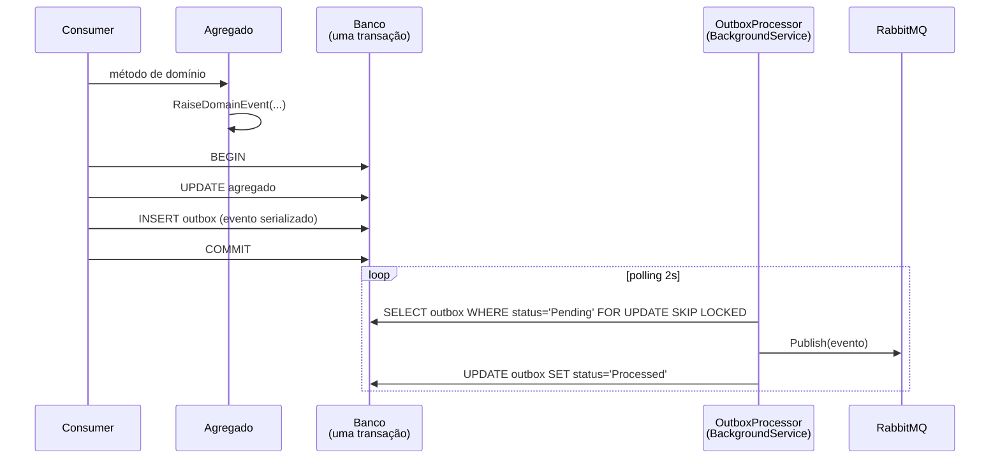

# Outbox transacional

> **Rótulo:** Explicação
> **TL;DR:** Eventos são persistidos **na mesma transação** do agregado e despachados depois por um background service. Resolve o dual-write problem.
> **Última revisão:** 2026-05-18

## O problema do dual-write

Sem outbox:

```csharp
await dbContext.SaveChangesAsync();  // ✅ commit no banco
await publisher.Publish(domainEvent); // ❌ broker fora do ar?
```

Se o broker estiver indisponível após o commit no banco, o evento se perde. Reciprocamente, se publicarmos antes do commit e o commit falhar, consumidores reagem a um fato que nunca aconteceu.

## A solução

O **evento vai para uma tabela/coleção local** (`outbox_messages` / `pagamento_outbox`) **na mesma transação** do agregado:



**At-least-once garantido:** se o broker cair, o background service tenta de novo. Se cair durante o despacho, a tag `Pending` continua na próxima iterção (idempotência no consumer cuida das duplicidades).

## Implementação por serviço

### API Ordem de Serviço (PostgreSQL)

- Tabela `outbox_messages` no mesmo schema do agregado.
- `OutboxProcessor` (background service) faz polling de 2s.
- `SELECT ... FOR UPDATE SKIP LOCKED` permite **múltiplas instâncias** sem duplicar trabalho.
- DLQ após 10 tentativas (configúrável via `OUTBOX__MAX_RETRIES`).

### API Pagamentos (MongoDB)

- Coleção `pagamento_outbox`.
- Atomicidade via `IClientSessionHandle` em transação multi-documento (requer replica set).
- `MongoOutboxProcessor` usa `findOneAndUpdate` para claim atômico, com TTL fallback.

### API Cadastros (PostgreSQL)

- Tabela `OutboxMessages` para eventos do **webhook de orçamento**.
- Garante que `orcamento-aprovado-pelo-cliente.v1` (ou rejeitado) chega à OS mesmo se o broker estiver fora no momento do POST do cliente.

## Métricas

Meter `MecanicaHermes.*.Outbox`:

- `outbox.messages.dispatched` — evento publicado com sucesso.
- `outbox.messages.failed` — falha em uma tentativa (vai retry).
- `outbox.messages.dead_lettered` — falha definitiva após todas as tentativas.

Monitorar `dead_lettered > 0` em [Dashboards](Dashboards-e-alertas).

## Recuperação manual

Se um lote de mensagens cair em `DeadLettered` por bug determinístico (ex.: schema drift), depois de corrigir o bug:

```sql
UPDATE outbox_messages
SET status = 'Pending', retry_count = 0, error = NULL
WHERE status = 'DeadLettered' AND created_at > '2026-05-18';
```

O processor vai retomar.

## Veja também

- [SAGA com MassTransit](SAGA-com-MassTransit)
- [Idempotência cross-service](Idempotencia-cross-service)
- [DLQ observability](DLQ-observability)
- [Resposta a incidentes](Resposta-a-incidentes)
