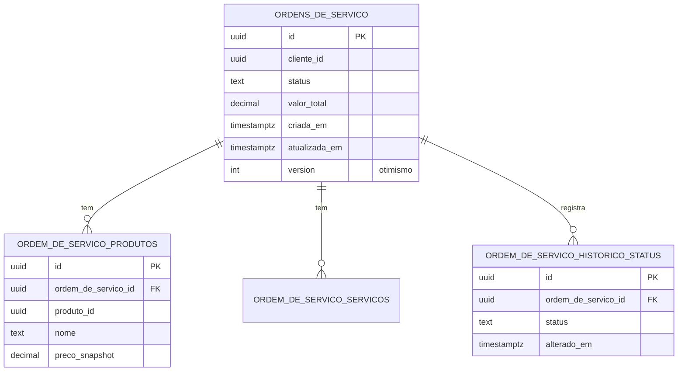
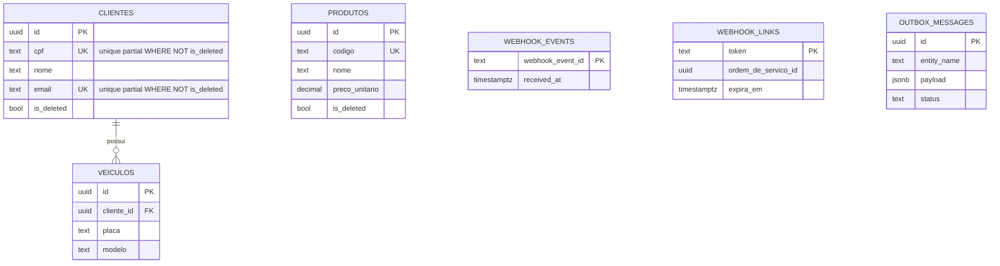

# PostgreSQL

> **Rótulo:** Referência
> **TL;DR:** RDS PostgreSQL 17.6 (`db.t4g.micro`) hospeda os bancos da OS e de Cadastros. EF Core 10 com migrations automatizadas no startup.
> **Última revisão:** 2026-05-18

## Instância

| Recurso | Valor |
|---|---|
| Engine | PostgreSQL 17.6 |
| Instância | `db.t4g.micro` |
| Storage | gp3, criptografado em repouso (KMS) |
| Backup | retention 7 dias, snapshot final ao destruir |
| Acesso | privado — apenas dentro da VPC, sem `public_access` |
| Multi-AZ | não (custo) |
| Ambientes | `hml` e `prd` (instâncias separadas) |

Provisionada pelo módulo `db/` do `mecanica-hermes-infra`.

## Bancos

| Serviço | Banco | Schemas principais |
|---|---|---|
| API Ordem de Serviço | `MecHermesOrdemDeServicoDB` | `public` (agregado + outbox + histórico) |
| API Cadastros | `mecanica_hermes_cadastros` | `public` (clientes, veículos, produtos, webhook events, outbox) |

## ER da OS (simplificado)



## ER de Cadastros (simplificado)



## Índices únicos parciais (Cadastros)

Soft delete + unique constraint normal seria conflitante (não conseguiríamos recriar um cliente deletado com o mesmo CPF). Solução: índices únicos **filtrados**:

```sql
CREATE UNIQUE INDEX ix_clientes_cpf_active
  ON clientes (cpf)
  WHERE is_deleted = FALSE;

CREATE UNIQUE INDEX ix_produtos_codigo_active
  ON produtos (codigo)
  WHERE is_deleted = FALSE;
```

## Migrations

EF Core 10 + Npgsql:

```bash
dotnet ef migrations add <Name> --project src/Mecanica.Hermes.<svc>.Infrastructure --startup-project src/Mecanica.Hermes.<svc>.Api
```

As migrations são aplicadas **automaticamente no startup** via `MigrateDatabaseAsync()` em ambos os serviços. Em produção, isso significa que o primeiro pod a subir aplica; os demais esperam.

## Senha do banco

Gerenciada pelo **AWS Secrets Manager** (Master Secret do RDS). Os pods leem via Kustomize Secret — ver [Cluster Kubernetes](Cluster-Kubernetes).

A Lambda CognitoToken também lê a senha do mesmo Secret consolidado — ver [Lambda CognitoToken](Lambda-CognitoToken).

## Veja também

- [Bancos de dados](Bancos-de-dados)
- [Outbox transacional](Outbox-transacional)
- [Idempotência cross-service](Idempotencia-cross-service)
