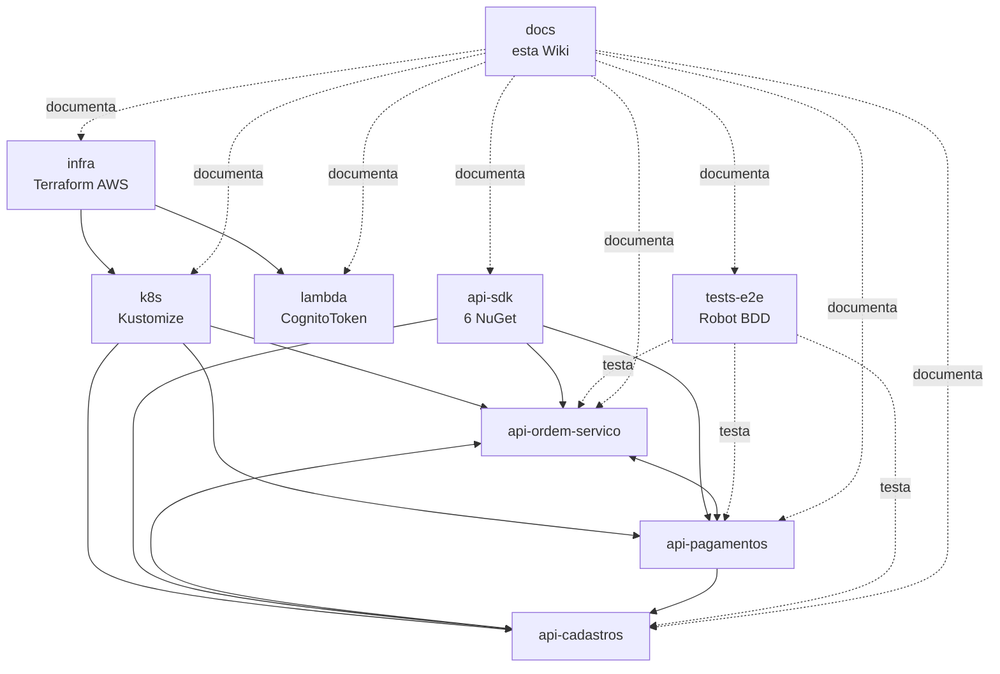

# Repositórios

> **Rótulo:** Referência
> **TL;DR:** Os 9 repositórios do ecossistema Mecânica Hermes, em uma tabela.
> **Última revisão:** 2026-05-19

## Tabela mestre

| # | Repositório | Categoria | Stack | Papel resumido |
|---|---|---|---|---|
| 1 | [`mecanica-hermes-infra`](Repo-mecanica-hermes-infra) | Infraestrutura | Terraform + AWS | VPC, EKS, RDS, Cognito, API Gateway |
| 2 | [`mecanica-hermes-k8s`](Repo-mecanica-hermes-k8s) | Infraestrutura | Kustomize + Helm | Deploy das APIs no EKS |
| 3 | [`mecanica-hermes-lambda`](Repo-mecanica-hermes-lambda) | Infraestrutura | .NET 10 (Lambda) | CognitoToken — login do cliente via CPF |
| 4 | [`mecanica-hermes-api-ordem-servico`](Repo-mecanica-hermes-api-ordem-servico) | Domínio | .NET 10 + Postgres + Rabbit + Mongo | Orquestrador da OS |
| 5 | [`mecanica-hermes-api-cadastros`](Repo-mecanica-hermes-api-cadastros) | Domínio | .NET 10 + Postgres | Clientes, Produtos, webhook de orçamento |
| 6 | [`mecanica-hermes-api-pagamentos`](Repo-mecanica-hermes-api-pagamentos) | Domínio | .NET 10 + Mongo | Integração Mercado Pago |
| 7 | [`mecanica-hermes-api-sdk`](Repo-mecanica-hermes-api-sdk) | Plataforma | .NET 10 + GitHub Packages | 6 pacotes NuGet compartilhados |
| 8 | [`mecanica-hermes-tests-e2e`](Repo-mecanica-hermes-tests-e2e) | Qualidade | Python + Robot + Allure | Suíte E2E BDD |
| 9 | [`mecanica-hermes-docs`](Repo-mecanica-hermes-docs) | Documentação | Markdown + GitHub Wiki | Esta Wiki |

## Como eles se conectam

## Veja também

- [Arquitetura](Arquitetura) — visão C4 do sistema
- [Catálogo de eventos](Catalogo-de-eventos) — contratos entre serviços
