# Runbook macro

> **Rótulo:** How-to
> **TL;DR:** Fluxograma de triagem para incidentes cross-service. Use isto antes do runbook específico do serviço.
> **Última revisão:** 2026-05-18

## Fluxograma de triagem

```mermaid
flowchart TD
  start([Alerta recebido]) --> what{Qual o sintoma?}

  what -->|HTTP 5xx em massa| svc[Identificar serviço]
  what -->|OS travada em estado| stuck[OS travada]
  what -->|DLQ ativa| dlq[Mensagem em DLQ]
  what -->|Outbox dead-lettered| ob[Outbox parou]
  what -->|Webhook MP desync| mp[MP não confirma]
  what -->|Cluster K8s| k8s[Namespace ou pod]

  svc --> svcLogs[New Relic → service.name<br/>filtrar level=Error]
  svc --> svcRunbook[Runbook do serviço específico]

  stuck --> stuckSaga{Saga ainda em voo?}
  stuckSaga -->|Sim| timeoutSaga[Aguardar sentinel ou forçar release]
  stuckSaga -->|Não| stuckEvent[Verificar evento cross-service:<br/>foi publicado? foi consumido?]

  dlq --> dlqLook[New Relic → messaging.consume_faults<br/>FACET message_type, exception_type]
  dlqLook --> dlqAction[Resposta a incidentes → DLQ]

  ob --> obQuery[SELECT * FROM outbox_messages<br/>WHERE status='DeadLettered']
  obQuery --> obAction[Resposta a incidentes → Outbox]

  mp --> mpPoll[Verificar polling status:<br/>pagamento.polling.executado]
  mp --> mpRunbook[Runbook Pagamentos → MP]

  k8s --> k8sStuck[Forçar limpeza de namespace]
```



## Quem você vê no painel

Independente do sintoma, sempre começe abrindo:

1. **Service Map** do New Relic — vê de relance qual serviço está sangrando, e se a falha é isolada ou cascade.
2. **Lista de erros recentes** — `SELECT count(*) FROM Span WHERE response.status >= 500 FACET service.name SINCE 30 minutes ago`.
3. **Dashboard "Saúde da plataforma"** ([Dashboards](Dashboards-e-alertas)).

## Correlation ID é seu amigo

Todo log e span carrega `correlation_id`. Se alguém reportar "OS abc... travou":

```sql
SELECT * FROM Log WHERE OrdemId = 'abc...'
  OR correlation_id IN (
    SELECT correlation_id FROM Log WHERE OrdemId = 'abc...'
  )
SINCE 1 day ago ORDER BY timestamp
```

Você recupera **toda a história** daquela OS atravessando OS → Cadastros → Pagamentos.

## Quando escalar para runbook específico

- Sabe o serviço e suspeita do problema → abra o runbook correspondente:
  - [Runbook — Ordem de Serviço](Runbook-Ordem-de-Servico)
  - [Runbook — Cadastros](Runbook-Cadastros)
  - [Runbook — Pagamentos](Runbook-Pagamentos)
- Problema parece de mensageria/outbox → [Resposta a incidentes](Resposta-a-incidentes).
- Problema parece de Kubernetes — pod travado, namespace `Terminating` → [Forçar limpeza de namespace](Forcar-limpeza-de-namespace).

## Veja também

- [Observabilidade](Observabilidade)
- [Dashboards e alertas](Dashboards-e-alertas)
