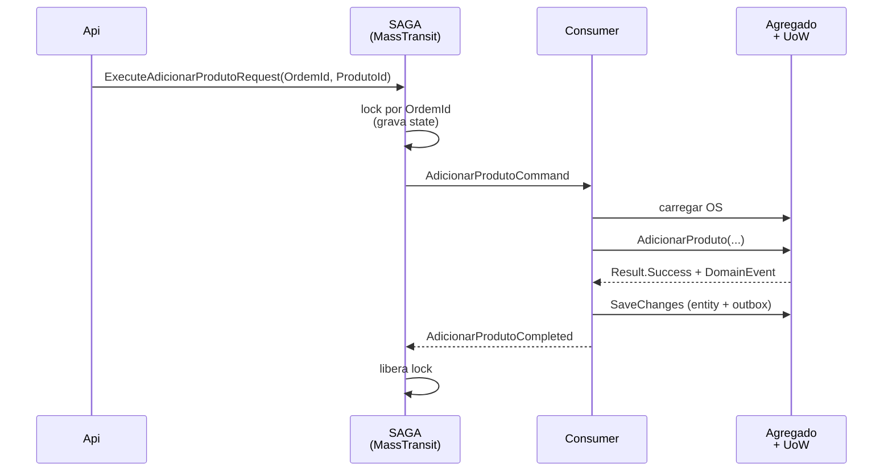

# SAGA com MassTransit

> **Rótulo:** Explicação
> **TL;DR:** SAGA serializa operações por chave do agregado. Máximo **1 operação em voo por OS** ou por Pagamento. Retry e redelivery automáticos.
> **Última revisão:** 2026-05-18

## O problema que resolve

Sem SAGA, duas requisições concorrentes para a mesma OS podem ler estado consistente, mas escrever em cima uma da outra (lost update). Ou pior: avançar para `EmExecucao` enquanto outro comando ainda está em `AguardandoAprovacao`.

A SAGA **serializa** — enquanto uma operação está em voo para um `OrdemDeServicoId`, novos comandos para o mesmo ID ficam esperando na fila.

## Implementação

Usamos **MassTransit Sagas** com state machine. O `OrdemDeServicoStateMachine` (em `Infrastructure/MassTransit/`) define:

- **Initial state** — quando o primeiro comando chega para um `OrdemId`.
- **States** — representam onde a saga está esperando (em geral apenas `AwaitingConsumer`, mas pode ter estados intermediários para operações multi-passo).
- **Events** — `Execute*Request` (comandos) e `*Completed` / `*Failed` (callbacks).
- **Behaviors** — retry, redelivery, timeout.

Estado persiste em:

- **MongoDB** para a OS (coleção `saga_ordem_de_servico`) e Pagamentos (coleção `saga_pagamento`).

## Pipeline padrão de um comando

Se um segundo comando para o mesmo `OrdemId` chega enquanto o primeiro está em voo, ele fica na fila até a saga liberar o lock.

## Retry e redelivery

Política padrão (configurada em `BusFactoryConfiguratorExtensions.ConfigureCommonFactory`):

- **Immediate retry:** 3 tentativas no mesmo processo, sem backoff.
- **Delayed redelivery:** 3 tentativas com backoff exponencial (1m, 5m, 15m).
- **Total:** até ~21 minutos até cair na DLQ.

A delayed redelivery usa o plugin `rabbitmq_delayed_message_exchange` (por isso a imagem custom do Rabbit).

## Quem usa SAGA

- **API Ordem de Serviço** — SAGA principal. Todos os comandos de mutação passam por ela.
- **API Pagamentos** — SAGA própria, com timer extra para o polling do MP. Ver [Fluxo — Caminho feliz](Fluxo-Caminho-feliz#fase-de-pagamento).
- **API Cadastros** — **não** usa SAGA. É puramente reativo (consumers que enviam e-mail; webhook publica via Outbox).

## Idempotência dos consumers cross-service

Mesmo com SAGA serializando, eventos cross-service podem chegar duas vezes (retry do publisher do outro serviço ou redelivery do MP). Por isso os consumers de integração **verificam o estado-fonte** antes de despachar à SAGA — ver [Idempotência cross-service](Idempotencia-cross-service).

## Veja também

- [Filas, retry, redelivery](Filas-retry-redelivery) — detalhes da política
- [Outbox transacional](Outbox-transacional)
- [DLQ observability](DLQ-observability)
- [Catálogo de eventos](Catalogo-de-eventos)
