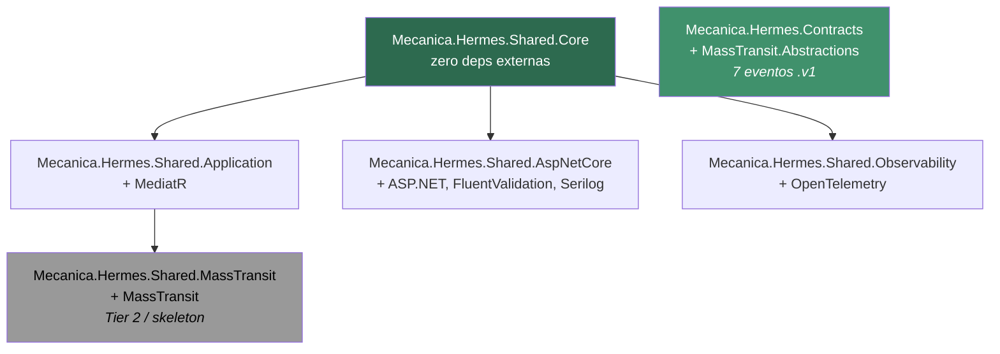

# SDK — Visão dos 6 pacotes

> **Rótulo:** Referência
> **TL;DR:** 6 pacotes NuGet compartilhados publicados em GitHub Packages na org `fiap-challenge-13soat`.
> **Última revisão:** 2026-05-18

## Pirâmide de pacotes

## O que cada pacote oferece

| Pacote | Conteúdo principal |
|---|---|
| `Mecanica.Hermes.Shared.Core` | `Result`/`Result<T>`, `BaseDomain`, `AggregateRoot`, `IDomainEvent`, `DomainClock`, `IUnitOfWork`, `ConcurrencyConflictException`, `PaginationParams`, `PagedResult`, `EnvironmentNames`, `DomainEventNameAttribute` |
| `Mecanica.Hermes.Shared.Application` | `IAsyncCommand`, `IAsyncMessagePublisher`, `AsyncCommandHandler`, `LoggingBehavior` (MediatR pipeline) |
| `Mecanica.Hermes.Shared.AspNetCore` | `CorrelationIdMiddleware`, `DevelopmentAuthenticationMiddleware`, `MiddlewareExtensions`, `ValidationFilter<T>`, `ApiProblemDetails`, `EndpointConventions`, `HealthCheckTags` |
| `Mecanica.Hermes.Shared.Observability` | `ActivitySources.MecanicaHermes.Api` (source padrão); planejado: `OtlpEnvironment`, hooks de `ObservabilityConfiguration` |
| `Mecanica.Hermes.Shared.MassTransit` (Tier 2) | esqueleto: `ConfigureSaga<TStateMachine, TState>`, `KebabCaseEndpointNameFormatterFactory`, `MassTransitMessagePublisher` |
| `Mecanica.Hermes.Contracts` | os 7 records `.v1` ([Catálogo de eventos](Catalogo-de-eventos)) |

## Princípios

1. **Core sem deps externas** — utilizável em qualquer projeto, mesmo sem MediatR/MassTransit/ASP.NET.
2. **Contracts desacoplado** — não referencia `Core` nem `Application`. Permite consumidores externos (BFFs, jobs) usarem só os contratos.
3. **MassTransit é Tier 2** — fica como esqueleto em v1.0; código real migra após os 3 repos adotarem Tier 1.
4. **Zero-refactor migration** — em v1.0, nenhum tipo público mudou de assinatura. Migração dos consumers é apenas `using` + `<PackageReference>`.

## Versão

Ver [SDK — Versionamento](SDK-Versionamento).

## Veja também

- [SDK — Como consumir](SDK-Como-consumir)
- [Catálogo de eventos](Catalogo-de-eventos)
- [Repo: mecanica-hermes-api-sdk](Repo-mecanica-hermes-api-sdk)
