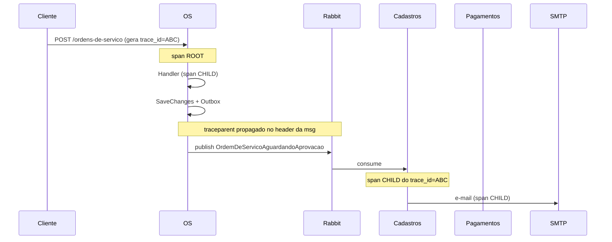

# Traces distribuídos

> **Rótulo:** Explicação
> **TL;DR:** Cada request HTTP gera um trace. A propagação passa pelo RabbitMQ via header `traceparent`, ligando spans cross-service.
> **Última revisão:** 2026-05-18

## Como funciona

No New Relic Service Map, todos os spans aparecem **ligados ao mesmo trace_id**.

## ActivitySources

| Source | Onde |
|---|---|
| `MecanicaHermes.Api` | Spans manuais em endpoints (do SDK `Shared.Observability`) |
| `MecanicaHermes.<svc>.Application` | Spans em handlers/consumers |
| `MecanicaHermes.<svc>.Infrastructure` | Spans em operações de banco e Mercado Pago client |

Auto-instrumentações automaticamente cobertas:

- `Microsoft.AspNetCore` (entrada HTTP)
- `Npgsql` (queries Postgres)
- `MongoDB.Driver` (queries Mongo)
- `System.Net.Http` (chamadas HTTP outbound, incluindo MP)
- `MassTransit` (publish, consume, saga)

## Span attributes

Alguns atributos custom adicionados:

- `mechermes.ordem_id` (OS)
- `mechermes.pagamento_id` (Pagamentos)
- `mechermes.cliente_id` (Cadastros)
- `mechermes.event_name` (em consumer)

Isso permite **filtrar traces no New Relic** por ID de negócio (não só por técnico).

## Latency budget

Por operação (p99):

| Operação | Budget |
|---|---|
| `POST /ordens-de-servico` (HTTP, 202) | 200ms |
| `GET /ordens-de-servico/{id}` | 300ms |
| Consumer `AdicionarProdutoCommand` | 1s |
| Consumer integration `OrcamentoAprovado` | 500ms |
| HTTP M2M `GET /api/clientes/{id}` | 200ms |
| HTTP outbound Mercado Pago `POST /preferences` | 2s |

## Veja também

- [Observabilidade](Observabilidade)
- [Logs](Logs)
