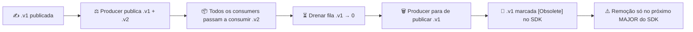

# Versionamento de contratos

> **Rótulo:** Explicação
> **TL;DR:** Eventos cross-service usam sufixo `.v1` no `EntityName`. **Nunca alteramos a forma** de um evento publicado — mudanças criam `.v2` em paralelo + janela de drenagem.
> **Última revisão:** 2026-05-18

## Princípio

Contratos publicados são **imutáveis em produção**. Consumidores podem estar em versões diferentes, podem ter mensagens "em voo" no broker, e nada pode parar de funcionar.

MassTransit serializa records posicionalmente em alguns transports — adicionar um campo opcional em um `record` já publicado pode quebrar consumers antigos. Por isso tratamos qualquer mudança de schema como **breaking change**.

## Regra de evolução



## Passos práticos para evoluir um evento

1. **Criar novo record** com sufixo `.v2`:

   ```csharp
   [EntityName("pagamento.confirmado.v2")]
   public record PagamentoConfirmadoEventV2(
       Guid PagamentoId,
       Guid OrdemDeServicoId,
       decimal Valor,
       DateTime OcorridoEm,
       string Moeda); // novo campo
   ```

2. **Producer publica os dois** simultaneamente (durante a janela de migração).

3. **Consumers migram um a um** para `.v2` (em PRs independentes).

4. **Drenar a fila `.v1`** — confirmar via RabbitMQ Management UI que não há mensagens pendentes.

5. **Producer remove `.v1`** — PR no producer.

6. **Marcar `.v1` como `[Obsolete]`** no SDK — ainda existe para compatibilidade, mas avisa o compilador.

7. **Remoção** — só no próximo MAJOR do SDK (com aviso em release notes).

## SemVer do SDK

Ver [SDK — Versionamento](SDK-Versionamento).

- **MAJOR** — remoção de `EntityName`, mudança de assinatura pública.
- **MINOR** — adição de novo `EntityName` (`.v2`).
- **PATCH** — fix interno sem afetar API pública.

## O que **não** é quebra de schema

- Adicionar **um novo evento** (`.v1` novinho). Nenhum consumer existente quebra.
- Adicionar uma nova rota HTTP. Nenhum cliente HTTP existente quebra.
- Adicionar coluna NULLABLE em tabela do próprio serviço. Schema interno — não é contrato.

## O que **é** quebra de schema

- Adicionar campo (mesmo opcional) em `record` já publicado.
- Renomear `EntityName`.
- Renomear ou remover propriedade.
- Mudar tipo de propriedade.
- Mudar ordem dos parâmetros do construtor positional.

## Smoke test contra renomeação acidental

O SDK tem `IntegrationEventNamesTests` em `tests/Mecanica.Hermes.Shared.Tests/Contracts/`. Falha se um `EntityName` mudar — protege contra rename automático do IDE.

## Veja também

- [Catálogo de eventos](Catalogo-de-eventos)
- [SDK — Versionamento](SDK-Versionamento)
